# AI 기반 방산 탄피·탄두 조립 자동화 시스템

### 3조 Aegis Robotics · 조별 프로젝트

**프로젝트 기간 · 2026년 8월 3일 ~ 2026년 9월 17일**

> **운반은 TurtleBot3가, 조립은 FR5와 AI가, 검증과 기록은 디지털 트윈과 서버가 맡습니다.**

FAIRINO FR5 협동로봇과 TurtleBot3가 부품 운반 → 비전 기반 Pick & Place → 강화학습 나사 체결 → 모방학습 완제품 이동 → 완제품 운반·적재까지 한 공정으로 수행하고, AR · 디지털 트윈 · 온·습도 안전관리 · 재고 DB가 이를 관제하는 스마트 팩토리 프로젝트입니다.


<a href="https://youtu.be/sCEMPYYk_f4">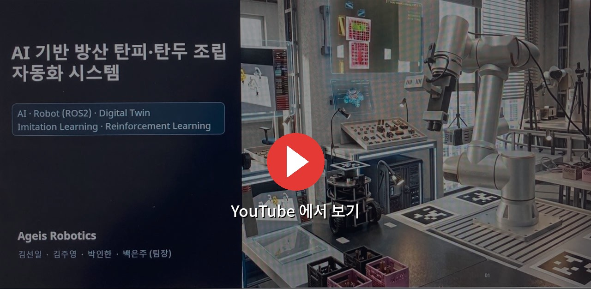</a>


## 1. 팀 구성 및 역할

| 담당자 | 담당 파트 | 주요 기여 |
| :---: | :---: | --- |
| 백⁠은⁠주<br>(팀장) | MuJoCo 활용 ⁠R⁠L⁠(⁠강⁠화⁠학⁠습⁠)⁠ ⁠·⁠ ⁠환⁠경⁠제⁠어⁠시⁠스⁠템 ⁠·⁠ ⁠V⁠L⁠A⁠ | 탄두–탄피 나사 체결 PPO 강화학습 환경 · 정책 · 실기 실행, MQTT 기반 온 · 습도 환경제어 폐루프, SAM3 탄두 인식률 개선 아이디어 발굴 |
| 김⁠선⁠일 | 3⁠D⁠ ⁠모⁠델⁠링⁠ ⁠·⁠ ⁠I⁠L⁠(⁠모⁠방⁠학⁠습⁠)⁠ ⁠·⁠ ⁠V⁠L⁠A⁠ ⁠·⁠ ⁠R⁠O⁠I⁠ ⁠관⁠제 | 고정대 · 부품 3D 모델링, SAM3 비주얼 서보잉 기반 탄피 · 탄두 Pick & Place, LeRobot 모방학습 데이터 수집과 완제품 이동, ROI 산출 · 환경제어시스템 UI 관제 |
| 김⁠주⁠영 | A⁠R⁠ ⁠·⁠ ⁠관⁠제⁠ ⁠U⁠I⁠ ⁠·⁠ ⁠T⁠u⁠r⁠t⁠l⁠e⁠B⁠o⁠t⁠3 | 마커 AR · WebXR · 디지털 트윈, FR5 웹 관제 화면과 안전 관문, TurtleBot3 부품 · 완제품 운반 자율주행 |
| 박⁠인⁠한 | A⁠I⁠ ⁠P⁠e⁠r⁠c⁠e⁠p⁠t⁠i⁠o⁠n⁠ ⁠·⁠ ⁠V⁠L⁠A | YOLO · SAM3 객체 인식, 카메라 각도 변경과 px–mm 보정값 적용, 비전 기반 Pick & Place 인식 개선 |

## 2. 프로젝트 주제

**AI 기반 방산 탄피·탄두 조립 자동화 시스템**

TurtleBot3가 부품을 조립 위치로 운반하면 FR5가 SAM3 비전으로 탄피 · 탄두를 인식해 고정대로 옮기고, PPO 강화학습 정책으로 탄두를 탄피에 돌려 끼웁니다. 모방학습 정책이 완성품을 보급상자로 옮기고, TurtleBot3가 적재 장소까지 운반해 하차합니다. 공정의 재고 변화는 Main Server DB와 시뮬레이션에 동기화되고, 온 · 습도 AI 안전관리가 결로를 예방하며, 위험 상황에서는 FR5와 TurtleBot3를 동시에 긴급정지합니다.

## 3. 주제 선정 이유

방산 탄약 공정은 실제 현장에서 이미 자동화가 진행되고 있습니다. Sandia National Laboratories는 9대 로봇 시스템으로 70만 개 이상의 다연장 로켓 자탄을 비무장화했고, VOP Nováky는 81~122mm 탄약 자동 생산라인을 준공했습니다. 반면 수동 공정은 인력 · 안전 · 검증 측면의 한계가 뚜렷합니다.

- **인력 감소 대응**: 제한된 인력으로도 안정적인 공정 운영이 가능한 자동화가 필요합니다.
- **위험 작업 최소화**: 사람의 직접 작업을 줄여 작업자 안전성을 높입니다.
- **수동 제어의 한계 극복**: 반복 동작을 AI가 학습하고, 작업 결과를 피드백하는 구조를 만듭니다.
- **데이터 기반 검증**: 반복 실험과 시뮬레이션으로 로봇 동작과 공정 결과를 검증합니다.
- **공정 연결**: 운반 · 조립 · 적재 · 재고 · 환경 안전을 하나의 데이터 흐름으로 묶습니다.

**최종 목표** — 사람이 직접 수행하는 반복 · 위험 작업을 줄이고, AI가 학습 · 판단하고 로봇이 실행하며 시스템이 결과를 기록하는 공정을 구현합니다.

## 4. 작업장 구성과 공정 흐름

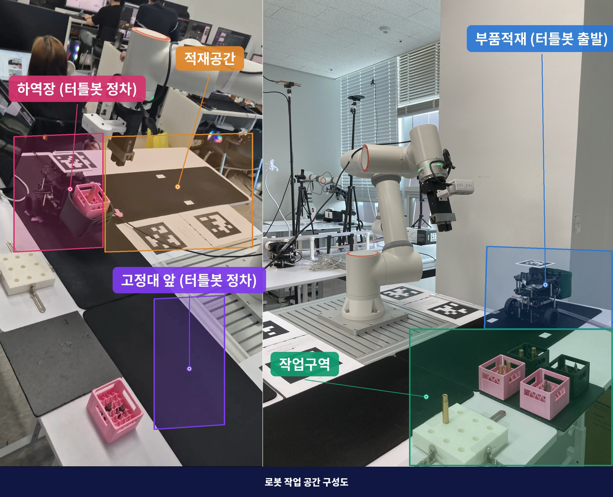

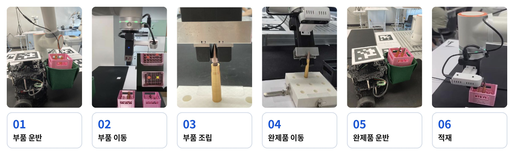

- 작업장은 **부품 보관함 · 고정대 · 보급상자 · 적재 장소**와 이를 잇는 TurtleBot3 이동 경로로 구성됩니다. AprilTag 마커를 기준으로 AR · 디지털 트윈과 실물 좌표를 맞춥니다.
- **FR5 작업대**에는 손목 RealSense D435 (eye-in-hand) 가 붙어 있고, 탄피 · 탄두를 꽂는 격자 **고정대**는 흔들리지 않으면서도 잘 뽑히도록 자체 제작했습니다.
- **TurtleBot3**는 출발지 → 조립 위치 → 적재 장소 → 복귀 순으로 이동하며, FR5는 조립 위치와 적재 장소 두 곳에서 상자를 싣고 내립니다.
- 조립 구간은 **MuJoCo 디지털 트윈**에서 먼저 학습 · 검증한 뒤 실기에 적용하고, 완제품 이동은 **LeRobot** 시연 데이터를 MuJoCo에서 재생해 확인한 뒤 실행합니다.
- 관제 시뮬레이션은 공정 사이클을 배속으로 재생하며 재고 · 소요 시간 · 온 · 습도 · 긴급정지 이력을 함께 표시합니다.

## 5. 운영 시나리오

### Scenario 1. 공정 기본 사이클

1. **부품 운반** — TurtleBot3가 부품 카트를 싣고 출발지에서 조립 위치로 이동하며, 작업장 환경을 모니터링합니다.
2. **부품 이동 (탄피)** — FR5가 SAM3로 탄피를 인식하고 화면 중심으로 서보한 뒤, 보관함에서 고정대로 Pick & Place 합니다.
3. **부품 이동 (탄두)** — FR5가 탄두를 인식해 집고, 고정대에 꽂힌 탄피 위로 정렬합니다.
4. **부품 조립** — MuJoCo에서 학습한 PPO 강화학습 정책이 탄두를 탄피의 나사선을 따라 돌려 끼웁니다. j6 가동범위 한계로 스트로크마다 그리퍼를 열고 손목을 되감아 재파지합니다.
5. **완제품 이동** — LeRobot으로 수집한 시연 데이터로 학습한 모방학습 정책이 결합된 탄약을 고정대에서 뽑아 보급상자로 옮기고, FR5가 보급상자를 TurtleBot3 위에 올립니다.
6. **완제품 운반 · 적재** — TurtleBot3가 적재 장소로 이동하고, FR5가 TurtleBot3 위의 완제품 상자를 적재 장소에 하차합니다. 임무 종료 후 복귀해 다음 임무를 대기합니다.

### Scenario 2. 환경 제어 시스템 (온 · 습도 기반 결로 예방)

1. 가상 센서가 작업장의 온도 · 습도 데이터를 주기적으로 발행합니다.
2. AI 안전 판단 엔진이 관리 기준(온도 21 ~ 28℃, 습도 35 ~ 40%)을 벗어나면 이상 상태로 판정합니다.
3. 판정 결과에 따라 환기 · 제습 · 냉방 액추에이터를 켜고, 그 효과가 다시 환경에 반영됩니다.
4. 온 · 습도 · 상태 · 제어 이력은 MQTT로 관제에 전달되고 Main Server에 실시간 저장됩니다.

### Scenario 3. 시뮬레이션 · 현실 재고 동기화

1. Main Server DB를 공정의 단일 기준 데이터로 사용합니다.
2. 부품 운반 · 조립이 일어나면 부품 재고 수량이 줄어듭니다.
3. 완제품 운반이 완료되면 제품 재고 수량과 상태가 갱신됩니다.
4. 시뮬레이션은 로봇 작업 사이클과 동기화해 생산량을 예측하고, 케이스별 소요 시간을 기록합니다.

### Scenario 4. 긴급정지

1. AR · 디지털 트윈에서 위험 상황(충돌 예상, 안전영역 침범)을 확인합니다.
2. 충돌이 감지되면 FR5와 TurtleBot3를 동시에 안전 상태로 전환하고 정지합니다.
3. 정지 상태에서 관제자의 재개 명령을 대기합니다.
4. 재개 명령이 내려오면 중단된 작업을 이어서 수행합니다.

## 6. 사용자 요구사항 (User Requirements)

| ID | 사용자 요구사항 | 우⁠선⁠순⁠위 |
| --- | --- | :---: |
| UR_01 | 로봇팔은 카메라로 부품을 인식할 수 있어야 한다. | R |
| UR_02 | 로봇팔은 부품을 조립할 수 있어야 한다. | R |
| UR_03 | 로봇팔은 작업 완료 후 제품 및 부품을 보급상자에 배치할 수 있어야 한다. | R |
| UR_04 | 로봇팔은 보급상자를 운반로봇에 적재할 수 있어야 한다. | R |
| UR_05 | 운반로봇은 부품 및 제품을 운반할 수 있어야 한다. | R |
| UR_06 | 관리자가 로봇의 상태를 모니터링할 수 있어야 한다. | R |
| UR_07 | 관리자(또는 작업자)는 위험 상황에서 즉시 로봇팔 및 운반로봇을 긴급 정지시킬 수 있어야 한다. | R |
| UR_08 | 관제 시스템은 시뮬레이션과 현실 재고 현황을 동기화할 수 있어야 한다. | R |
| UR_09 | 관제 시스템은 시뮬레이션을 통해 납기 수량을 완수하는 데 필요한 시간을 예측할 수 있어야 한다. | R |
| UR_10 | 관제 시스템은 공장 내 온습도를 모니터링할 수 있어야 한다. | O |
| UR_11 | 관제 시스템은 공장 내 온습도를 조정할 수 있어야 한다. | O |

우선순위 — **R** (Required, 필수) · **O** (Optional, 선택)

## 7. 시스템 요구사항 (System Requirements)

| ID | 기능 | 요구사항 | 우⁠선⁠순⁠위 |
| --- | --- | --- | :---: |
| SR_01 | 부⁠품⁠ ⁠인⁠식⁠ ⁠기⁠능 | 로봇팔은 부착된 카메라로 부품을 인식해야 한다. | R |
| SR_02 | 부⁠품⁠ ⁠조⁠립⁠ ⁠기⁠능 | 로봇팔은 부품을 조립해야 한다. | R |
| SR_03 | 제⁠품⁠ ⁠배⁠치⁠ ⁠기⁠능 | 로봇팔은 제품 및 부품을 보급상자에 배치해야 한다. | R |
| SR_04 | 보⁠급⁠상⁠자⁠ ⁠적⁠재⁠ ⁠기⁠능 | 로봇팔은 보급상자를 운반로봇에 적재해야 한다. | R |
| SR_05 | 제⁠품⁠ ⁠운⁠반⁠ ⁠기⁠능 | 운반로봇은 보급상자를 운반해야 한다.<br>· 지정된 경로의 구역을 반복적으로 이동한다.<br>· 이동 중 현재 위치를 관리자에게 전송한다. | R |
| SR_06 | 상⁠태⁠ ⁠모⁠니⁠터⁠링⁠ ⁠기⁠능 | 관제 시스템은 로봇의 상태를 실시간으로 제공해야 한다.<br>모니터링 정보:<br>· FR5 Joint 정보 (각도, 위치)<br>· 운반로봇 위치, 이동경로, 목표 위치<br>· 통신상태<br>· 작업상태 | R |
| SR_07 | 긴⁠급⁠ ⁠정⁠지⁠ ⁠기⁠능 | 관리자가 긴급 정지를 요청하면 시스템은 즉시 로봇팔 및 운반로봇의 모든 동작을 정지해야 한다. | R |
| SR_08 | 재⁠고⁠ ⁠현⁠황⁠ ⁠동⁠기⁠화⁠ ⁠기⁠능 | 관제 시스템은 시뮬레이션과 현실 재고 현황을 동기화해야 한다. | R |
| SR_09 | 필⁠요⁠ ⁠시⁠간⁠ ⁠예⁠측 | 관제 시스템은 시뮬레이션을 통해 납기 수량을 완수하는 데 필요한 시간을 예측해야 한다.<br>· 시간당 생산량 예측<br>· 환경에 대한 불량률 예측<br>· 생산량 최적의 작업라인 배치 및 동선 파악 | R |
| SR_10 | 온⁠습⁠도⁠ ⁠감⁠지⁠ ⁠기⁠능 | 관제 시스템은 공장 내 온습도를 감지해야 한다. | O |
| SR_11 | 온⁠습⁠도⁠ ⁠조⁠절⁠ ⁠기⁠능 | 관제 시스템은 공장 내 온습도를 조정해야 한다.<br>온도가 지정 온도(21 ~ 28℃)를 벗어났다면:<br>· 온도 21 ~ 28℃ 이내 유지<br>· 습도 35 ~ 40% 이내 유지 | O |

우선순위 — **R** (Required, 필수) · **O** (Optional, 선택)

## 8. 시스템 아키텍처

### 하드웨어 아키텍처


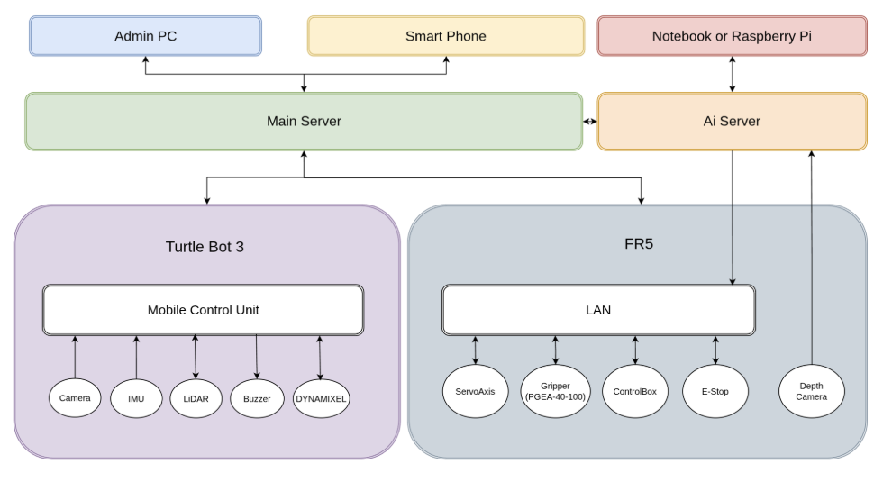

### 소프트웨어 아키텍처


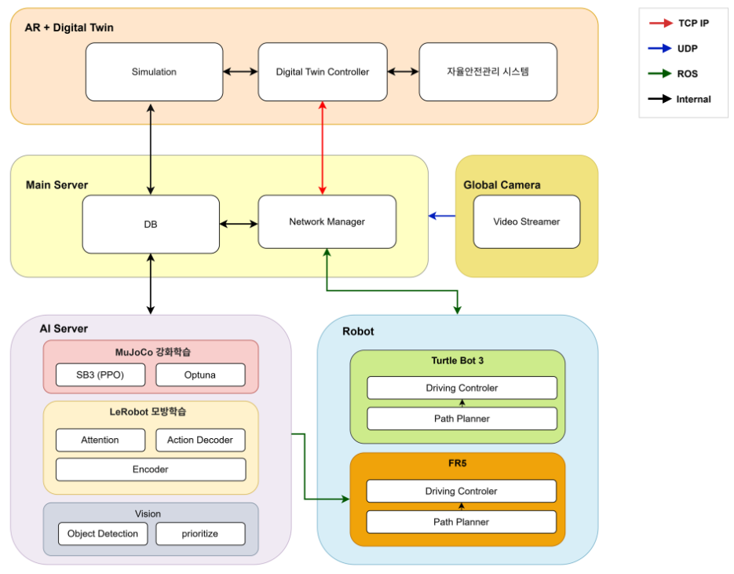

## 9. 시퀀스 다이어그램

### Scenario 1. 공정 기본 사이클

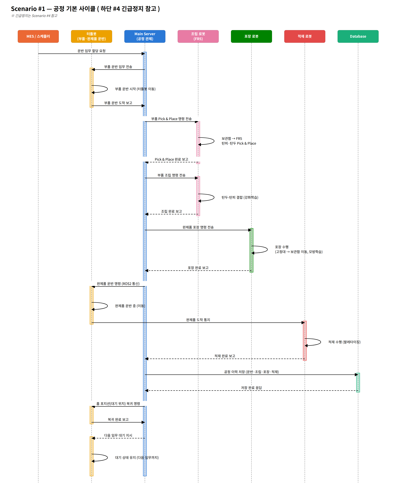

### Scenario 2. 환경 제어 시스템 (온 · 습도 기반 결로 예방)

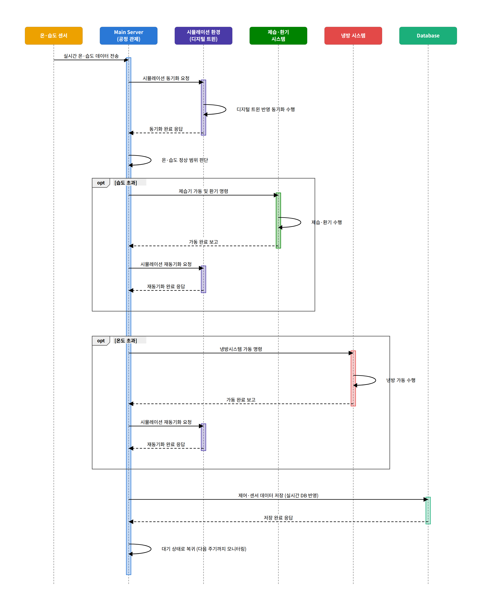

### Scenario 3. 시뮬레이션 · 현실 재고 동기화

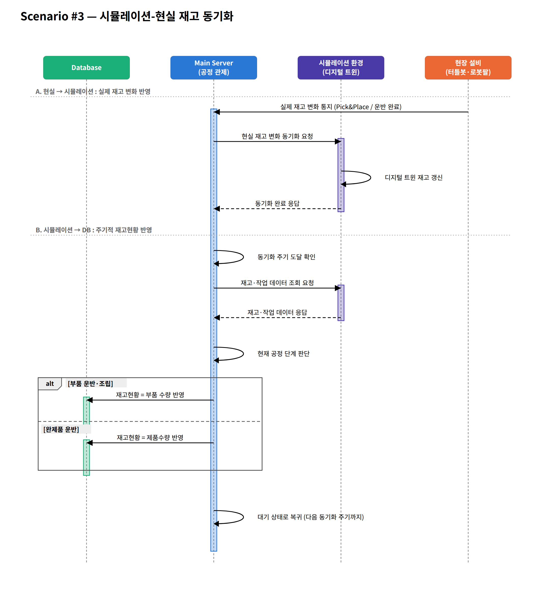

### Scenario 4. 긴급정지

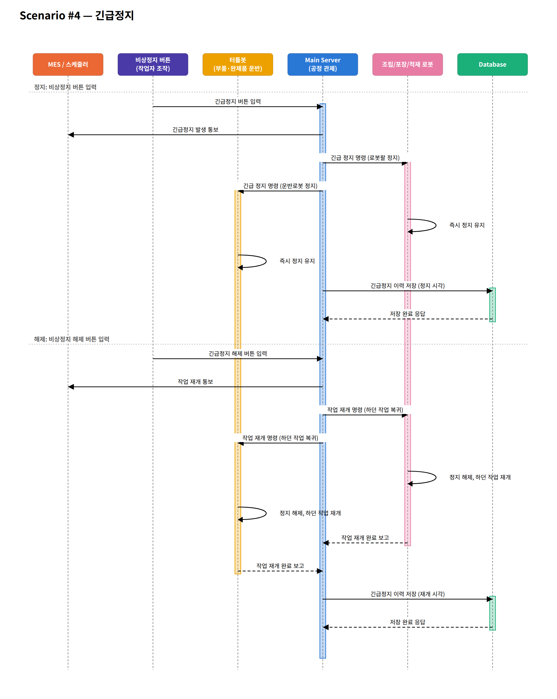

## 10. 상태 다이어그램

### Scenario 1. 공정 기본 사이클

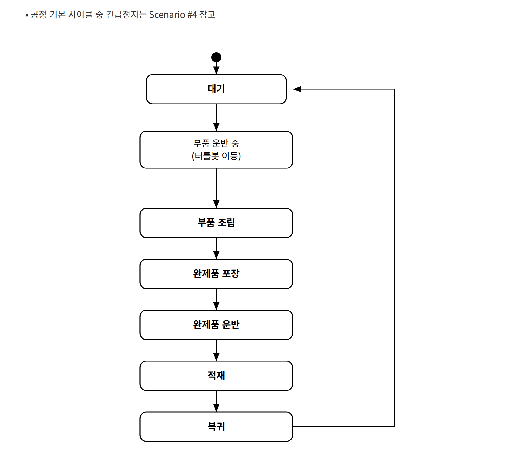

### Scenario 2. 환경 제어 시스템 (온 · 습도 기반 결로 예방)

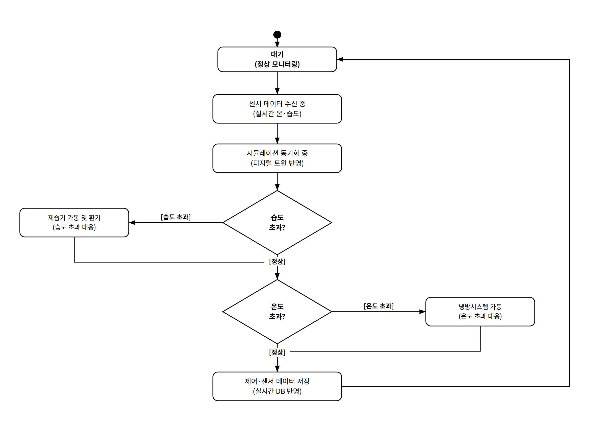

### Scenario 3. 시뮬레이션 · 현실 재고 동기화

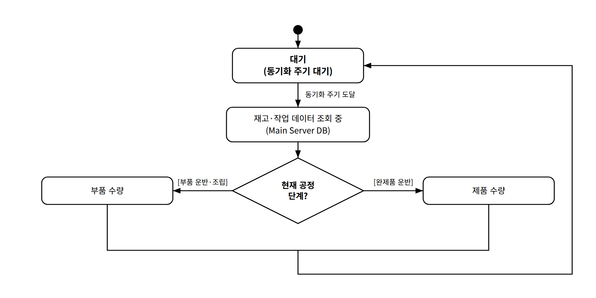

### Scenario 4. 긴급정지

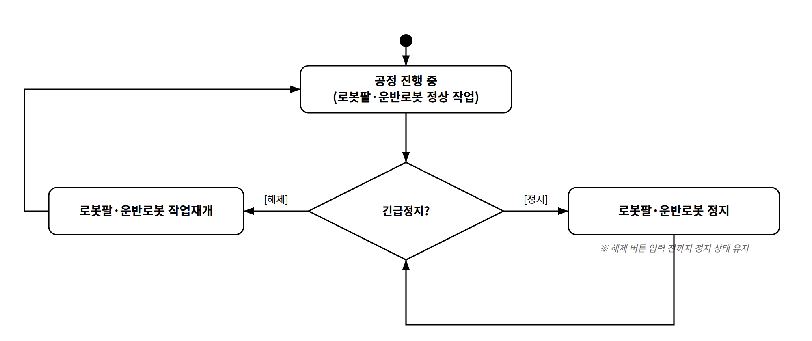

## 11. 소스 구성

```text
.
├── fr5-web/                             # AR : FR5 웹 관제 · 디지털 트윈 · AR/XR · TurtleBot/카메라 브리지 · DB
├── vision-pick-and-place/sam3/          # SAM3 비주얼 서보잉 탄피 · 탄두 Pick & Place (FR5 + D435 + ROS 2)
├── sam3-realsense/                      # SAM 3.1 텍스트 프롬프트 분할을 RealSense 프레임에 돌리는 테스트
├── fr5-screw-rl/                        # 탄두–탄피 나사 체결 PPO 강화학습 환경 · 학습된 정책 · 실기 실행
├── fr5-safety_system/                   # 가상 센서 기반 온 · 습도 제어 폐루프, MQTT 상태 발행
├── docs/                                # AR : FR5 통합 기능 · 증거 타임라인
└── assets/                              # README용 아키텍처 · 다이어그램 · 공정 · 영상 이미지
```

| 폴더 | 내용 |
|---|---|
| [`fr5-web/`](fr5-web/) | FR5 조작 화면 · 디지털 트윈 · 마커 AR · WebXR 답사 · TurtleBot 관문 · 손목 카메라 관문 · SQLite 수집기 |
| [`vision-pick-and-place/sam3/`](vision-pick-and-place/sam3/) | 픽셀 오차를 깊이와 초점거리로 mm 로 바꿔 서보하는 Pick & Place. 탄피는 전 구간, 탄두는 파지까지 담당 |
| [`sam3-realsense/`](sam3-realsense/) | SAM 3.1 멀티플렉스 비디오 예측기 단일 · 연속 프레임 · 실시간 분할 스크립트 |
| [`fr5-screw-rl/`](fr5-screw-rl/) | 나사 결합 지배식 `전진 = 회전 × 피치 ÷ 2π` 기반 학습 환경, PPO 학습 · 검증 · 녹화, dry-run 기본 실기 실행 |
| [`fr5-safety_system/`](fr5-safety_system/) | Virtual Sensor → Main Server → AI Safety Engine → Actuator → Simulation 폐루프, `environment/*` MQTT 토픽 |

각 구현 파트의 상세 내용은 해당 폴더의 README를 참고하세요.

## 12. 프로젝트 기술 스택

### 로봇 · 제어


### 시뮬레이션 · 학습


### AI · 컴퓨터 비전


### 관제 UI · AR · 디지털 트윈


### 서버 · 데이터 · 통신


### 사용 언어 · 3D 모델링


### 협업 · 프로젝트 관리


- **Git · GitHub**으로 소스 코드 버전 관리, 브랜치 기반 작업, Pull Request 검토 · 병합을 수행했습니다.
- **Slack**으로 실시간 소통, 작업 공유, 통합 테스트 일정을 조율했습니다.

## 13. 보안 및 제외 항목

다음 실행 자산과 민감 정보는 저장소에 포함하지 않습니다.

- 가상환경(`lib/`, `.venv/`)과 ROS 2 빌드 · 설치 산출물
- SAM3 · YOLO 체크포인트와 선정 정책을 제외한 강화학습 · 모방학습 모델 가중치
- 학습 로그(`train_runs/`), 튜닝 결과, LeRobot 시연 데이터셋
- 런타임 로그, 시연 영상, 발표 자료(pptx · html)
- DB 파일, 로봇 IP · 작업 원점 등 현장 설정값

---

**3조 Aegis Robotics**

---

## 부록. 폴더별 상세 안내

이전 README 의 내용을 그대로 옮긴 것이다. ROS 2 기반 AI 협동로봇 작업을 모은 저장소다. 폴더마다 독립된 작업이며 서로 의존하지 않는다.

### 폴더

| 폴더 | 내용 |
|---|---|
| [`sam3-realsense/`](sam3-realsense/) | SAM 3.1 텍스트 프롬프트 분할을 RealSense 프레임에 돌려 보는 테스트 스크립트 |
| [`vision-pick-and-place/sam3/`](vision-pick-and-place/sam3/) | SAM3 비주얼 서보잉으로 FR5 가 탄피·탄두를 집어 격자 트레이에 놓는 실기 프로젝트 |
| [`fr5-screw-rl/`](fr5-screw-rl/) | FR5 가 탄두를 탄피에 나사 결합하는 작업의 PPO 강화학습 환경과 학습된 정책 |
| [`fr5-safety_system/`](fr5-safety_system/) | 가상 센서 기반 온·습도 제어 폐루프. 상태를 MQTT 토픽으로 발행 |

#### `sam3-realsense/`

SAM 3.1 멀티플렉스 비디오 예측기(`build_sam3_multiplex_video_predictor`)를 RealSense 카메라에
붙여 텍스트 프롬프트로 물체를 분할한다.

- `scripts/test_realsense_single_frame.py` — 한 프레임 분할
- `scripts/test_realsense_two_frames.py` — 연속 두 프레임 분할
- `scripts/test_realsense_sam3.py` — 실시간 분할 (기본 프롬프트 `pink plastic crate`)

체크포인트 경로가 스크립트 안에 고정돼 있어 환경에 맞게 바꿔야 한다.

#### `vision-pick-and-place/sam3/`

FAIRINO FR5 + RealSense D435 (eye-in-hand) + ROS 2 Jazzy. SAM3 로 물체를 찾고, 화면 중심으로
X/Y 서보한 뒤, 파지 자세로 제자리 회전하고, 실측 보정값만큼 내려가 집는다.

| 대상 | 상태 |
|---|---|
| 탄피 | 홈 → 정렬 → 회전 → 파지 → 놓기 → 박기 → 복귀, 셀 안착 확인 |
| 탄두 | 홈 → 정렬 → 회전 → 파지 → 놓을 위치까지. 쥔 채 멈추고 돌려 끼우는 동작은 [`fr5-screw-rl/`](fr5-screw-rl/) 의 강화학습 정책에 넘긴다 |

- 실행: `VISIONSCRIPTS/sam3_pick_ros2.py`
- 실측 기록과 현재 실행 명령: `LEADME/비주얼서보잉-실기검증.md` **8절**
- 폴더 안 `README.md` 에 설치·실행 요약이 있다

#### `fr5-screw-rl/`

탄두를 탄피에 **돌려 끼우는** 구간을 PPO 로 학습한다.
`vision-pick-and-place/sam3/` 가 파지까지 하고 넘긴 지점부터다.

착좌까지 **6.25 바퀴**가 필요한데(전진 5.00mm ÷ 피치 0.8mm), j6 가동범위가 ±175° 라
한 스트로크가 **344° = 0.956 바퀴**뿐이다. 그래서 스트로크마다
`그리퍼 열기 → 손목 되감기 → 다시 잡기` 가 들어가고, 착좌까지 재파지가 6회 필요하다.

학습 환경은 **MuJoCo 물리를 쓰지 않는다.** 나사 결합의 지배 관계
`전진 = 회전 × 피치 ÷ 2π` 를 해석식으로 모델링했고, MuJoCo 는 역기구학 · 자기충돌 검사 ·
렌더링에만 쓴다. 30만 스텝 학습 1회가 1분에 끝나 반복 검증이 가능하다.

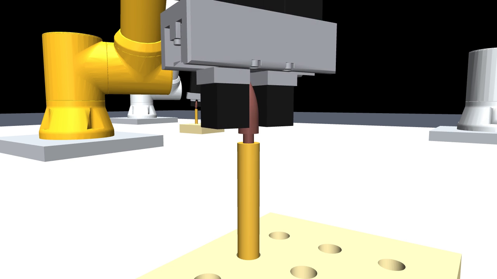
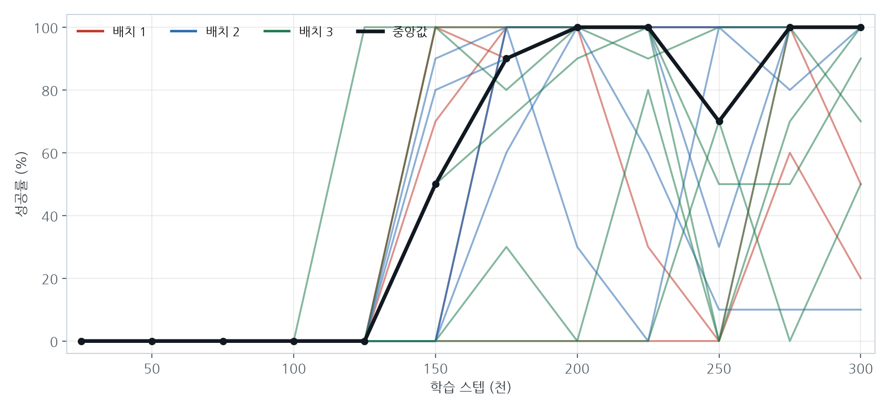

왼쪽 — 체결 중. 탄두가 회전하며 탄피 안으로 들어간다. 축방향 전진은 오직 회전으로만 일어난다.
오른쪽 — 동일 조건 15회 학습. 굵은 선이 중앙값이다. 15회 모두 10만 스텝까지 0% 이고,
첫 100% 도달이 12.5만~27.5만으로 흩어진다.

| 폴더 | 내용 |
|---|---|
| `src/` | 학습 환경 · PPO 학습/검증/녹화 · 실기 실행 스크립트 · MuJoCo 씬 · 실측 작업 원점 |
| `meshes/` | 로봇 · 그리퍼 · 탄두 · 탄피 · 고정대 STL 과 URDF |
| `models/` | 선정 정책 1개 — 20 에피소드 재평가 성공률 100%, 문지름 0.0 |
| `study_test/` | 초기 CartPole 연습 코드. 본 작업과 무관 |

- 학습: `src/train_screw_ppo.py --steps 300000`
- 확인: `src/verify_screw_policy.py` (MuJoCo 창)
- 실기: `src/fr5_execute_policy.py` — **기본이 dry-run**, 실물 실행에는 선행 조건 3개가 필요하다
- 폴더 안 `README.md` 에 상태·행동 공간, 실기 게이트, **알려진 한계**가 정리돼 있다

#### `fr5-safety_system/`

가상 센서로 온·습도를 만들고, 이상 상황을 판단해 냉방·제습·환기를 돌리고, 그 결과가 다시
환경에 반영되는 폐루프다. 나사 결합과 무관한 독립 하위 시스템이다.

```
Virtual Sensor → Main Server → AI Safety Engine → Actuator → Simulation → (되돌아감)
```

| 토픽 | payload | 발행 시점 |
|---|---|---|
| `environment/temperature` | `30.0` | 매 주기 (20초) |
| `environment/humidity` | `45.0` | 매 주기 |
| `environment/status` | `HIGH_TEMPERATURE,HIGH_HUMIDITY` | 상태가 바뀔 때만 |
| `environment/control` | JSON | 제어가 바뀔 때만 |

- 브로커 없이 시연: `env_demo.py`
- 관제 서버용 참조 구독자: `env_dashboard_client.py` — 이 파일만 넘기면 된다
- 정상 범위 온도 21 ~ 28℃ · 습도 35 ~ 40%
