# {{프로젝트 제목 — 예: 협동로봇·AMR 배치 생산성 실험 시스템}}

{{한 문단 — 무엇을 왜 만들었나. AMR 레포 예: "운영자의 입·출고 요청을 … 까지 연결한 ROS 2 기반 물류 자동화 프로젝트입니다."}}

{{두 번째 문단 — 서버·장치 역할 분담 한 줄. 예: 웹 작업대(FR5 브리지·AR·관제), ROS 2 AMR, Vision 이 역할을 나누되 하나의 실기 사이클로 묶인다.}}

{{데모 영상 URL — GitHub 이슈/PR 에 mp4 를 끌어다 놓으면 user-attachments 주소가 나온다}}

---

## 1. 팀 구성 및 역할

<table width="100%">
  <thead><tr><th width="20%" nowrap>팀원</th><th width="20%" nowrap>담당 영역</th><th width="60%" nowrap>주요 역할</th></tr></thead>
  <tbody>
    <tr><td align="center" nowrap>김주영</td><td nowrap>Web·Cobot Bridge·AR</td><td nowrap>FR5 웹 티칭 펜던트·안전 브리지, 폰 AR/XR 겹쳐 보기, 배치 관제·시뮬레이션</td></tr>
    <tr><td align="center" nowrap>백은주</td><td nowrap>{{영역}}</td><td nowrap>{{역할 한 줄}}</td></tr>
    <tr><td align="center" nowrap>김선일</td><td nowrap>{{영역}}</td><td nowrap>{{역할 한 줄}}</td></tr>
    <tr><td align="center" nowrap>박인한</td><td nowrap>{{영역}}</td><td nowrap>{{역할 한 줄}}</td></tr>
  </tbody>
</table>

## 2. 프로젝트 주제

<table width="100%">
  <thead><tr><th width="24%" nowrap>구분</th><th width="76%" nowrap>내용</th></tr></thead>
  <tbody>
    <tr><td nowrap>프로젝트 목표</td><td nowrap>{{조립 라인에서 로봇팔·AMR 의 배치와 동작 방식에 따라 생산성이 얼마나 달라지는지 측정}}</td></tr>
    <tr><td nowrap>운영 대상</td><td nowrap>FAIRINO FR5 협동로봇 1대 + PGEA-100-40 그리퍼 + 손목 D435 · TurtleBot3 Burger {{n}}대</td></tr>
    <tr><td nowrap>핵심 구성</td><td nowrap>FR5 Bridge(FastAPI), 웹 티칭 펜던트, AR/XR 겹쳐 보기, 배치 관제(Dashboard), MuJoCo 시뮬, TurtleBot Bridge, Vision Bridge, SQLite 기록</td></tr>
    <tr><td nowrap>로봇 제어</td><td nowrap>FAIRINO 공식 Python SDK(xmlrpc) · 브리지 단일 관문 · 조종권 1인</td></tr>
    <tr><td nowrap>이동 방식</td><td nowrap>{{ROS 2 Nav2 · SLAM · 웨이포인트 슬롯}}</td></tr>
    <tr><td nowrap>정밀 작업</td><td nowrap>AprilTag 36h11 앵커 · 손목 뎁스 거치대 검출 · hand-eye 5.74mm · 조준 2단(거울 쌍 평균)</td></tr>
    <tr><td nowrap>작업 검증</td><td nowrap>목업 / 시뮬 / 실기 3층 분리 · 출처 배지(mock·sim·measured)</td></tr>
    <tr><td nowrap>안전 전략</td><td nowrap>속도 10%·관절 5° 상한, `stop` 무조건 통과, fail-closed, 조건 27(AMR 정지 확인 후 팔 명령)</td></tr>
    <tr><td nowrap>상태 관리</td><td nowrap>{{run_id}} 기반 실행 기록(jsonl) · 슬롯 · 티칭 지점</td></tr>
  </tbody>
</table>

---

## 3. 주제 선정 이유

{{두세 문장 — 배치를 바꾸려면 실제로 장비를 옮겨야 하고, 옮긴 뒤에도 숫자가 없다. 그래서 옮기기 전에 화면에서 비교하고 실물 위에 겹쳐 보는 계기가 필요했다.}}

<table width="100%">
  <thead><tr><th width="42%" nowrap>선정 배경</th><th width="58%" nowrap>프로젝트 방향</th></tr></thead>
  <tbody>
    <tr><td nowrap>배치를 바꾸려면 장비를 실제로 옮겨야 한다</td><td nowrap>화면에서 배치안을 편집하고 지표를 비교</td></tr>
    <tr><td nowrap>옮긴 뒤에도 "나아졌다"는 숫자가 없다</td><td nowrap>같은 작업의 시퀀스 타임을 배치·동작별로 나란히 측정</td></tr>
    <tr><td nowrap>펜던트 앞 한 사람만 로봇을 볼 수 있다</td><td nowrap>앱 설치 없이 브라우저로 팀 전체가 같은 상태를 본다</td></tr>
    <tr><td nowrap>배치안이 실물과 맞는지 확인할 방법이 없다</td><td nowrap>폰 카메라로 배치안·안전 범위를 실물 위에 겹쳐 본다</td></tr>
    <tr><td nowrap>{{배경}}</td><td nowrap>{{방향}}</td></tr>
  </tbody>
</table>

---

## 4. 사용자 요구사항

<!-- fr5-web/docs/product/USER-REQUIREMENTS.md 의 UR 25개 중 구현된 것만 추린다 -->

<table width="100%">
  <thead><tr><th width="12%" nowrap>ID</th><th width="88%" nowrap>현재 구현된 사용자 요구사항</th></tr></thead>
  <tbody>
    <tr><td align="center" nowrap>UR-01</td><td nowrap>팀원은 앱 설치 없이 브라우저로 로봇 상태를 보고 조작할 수 있어야 한다.</td></tr>
    <tr><td align="center" nowrap>UR-02</td><td nowrap>로봇을 움직이는 사람은 한 번에 한 명이어야 하고, 나머지는 같은 화면을 볼 수 있어야 한다.</td></tr>
    <tr><td align="center" nowrap>UR-03</td><td nowrap>로봇은 언제든 즉시 정지할 수 있어야 한다.</td></tr>
    <tr><td align="center" nowrap>UR-04</td><td nowrap>사용자는 지점을 티칭하고 순서대로 실행할 수 있어야 한다.</td></tr>
    <tr><td align="center" nowrap>UR-05</td><td nowrap>사용자는 배치안을 화면에서 편집하고 생산성 지표를 비교할 수 있어야 한다.</td></tr>
    <tr><td align="center" nowrap>UR-06</td><td nowrap>사용자는 폰 카메라로 배치안·예정 경로·안전 범위를 실물 위에 겹쳐 볼 수 있어야 한다.</td></tr>
    <tr><td align="center" nowrap>UR-07</td><td nowrap>{{AMR — 로봇은 작업 구역 사이를 자율 이동할 수 있어야 한다.}}</td></tr>
    <tr><td align="center" nowrap>UR-08</td><td nowrap>{{추가}}</td></tr>
  </tbody>
</table>

## 5. 시스템 요구사항

<!-- fr5-web/docs/product/USER-REQUIREMENTS.md 의 SR 26개 중 구현된 것만 -->

<table width="100%">
  <thead><tr><th width="10%" nowrap>ID</th><th width="24%" nowrap>기능</th><th width="66%" nowrap>요구사항</th></tr></thead>
  <tbody>
    <tr><td align="center" nowrap>SR-01</td><td nowrap>조종권</td><td nowrap>브리지는 조종권을 한 명에게만 주고, 토큰 없는 명령은 거부한다.</td></tr>
    <tr><td align="center" nowrap>SR-02</td><td nowrap>안전 게이트</td><td nowrap>속도 10%·관절 5°·URDF 한계·신선도를 넘는 명령은 브리지가 거부한다.</td></tr>
    <tr><td align="center" nowrap>SR-03</td><td nowrap>정지</td><td nowrap><code>stop</code> 은 신원·조종권·잠금과 무관하게 항상 통과한다.</td></tr>
    <tr><td align="center" nowrap>SR-04</td><td nowrap>fail-closed</td><td nowrap>연결 손실·소유권 불명·값 미확인은 통과가 아니라 차단으로 처리한다.</td></tr>
    <tr><td align="center" nowrap>SR-05</td><td nowrap>상태 방송</td><td nowrap>브리지는 로봇 상태를 WebSocket 으로 33ms 마다 모든 접속자에게 방송한다.</td></tr>
    <tr><td align="center" nowrap>SR-06</td><td nowrap>티칭·실행</td><td nowrap>지점을 저장하고 프로그램으로 묶어 단계별 확인 후 실행한다.</td></tr>
    <tr><td align="center" nowrap>SR-07</td><td nowrap>출처 표시</td><td nowrap>화면의 모든 수치는 mock / sim / measured 출처 배지를 가진다.</td></tr>
    <tr><td align="center" nowrap>SR-08</td><td nowrap>배치 원점</td><td nowrap>배치안 좌표는 실험실 바닥 원점 기준 mm·도로 저장한다.</td></tr>
    <tr><td align="center" nowrap>SR-09</td><td nowrap>AMR 연동</td><td nowrap>AMR 이 정지 상태(데드밴드 5mm/s·3°/s)일 때만 팔 명령을 허용한다.</td></tr>
    <tr><td align="center" nowrap>SR-10</td><td nowrap>{{기능}}</td><td nowrap>{{요구사항}}</td></tr>
  </tbody>
</table>

---

## 6. 시스템 아키텍처

### 하드웨어 아키텍처

<p align="center">
  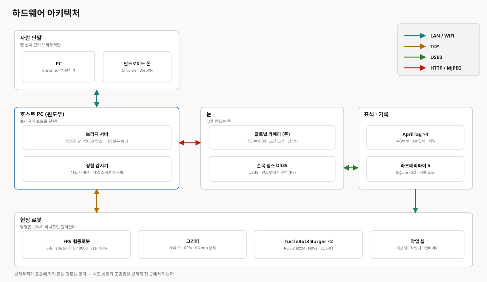
</p>

<!-- {{실물 사진 — 셀 전경 · FR5+그리퍼+D435 · TurtleBot}} -->
<p align="center">
  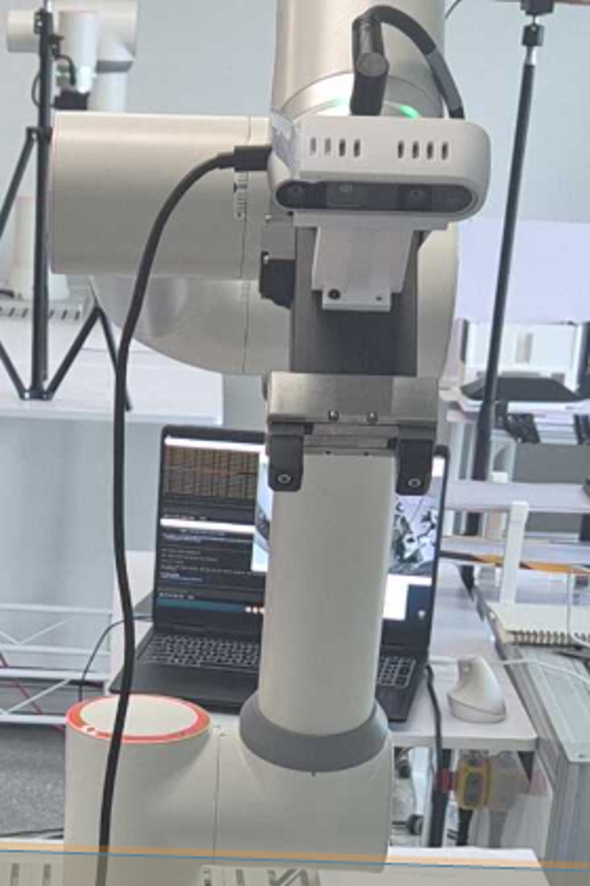
</p>

### 소프트웨어 아키텍처

<p align="center">
  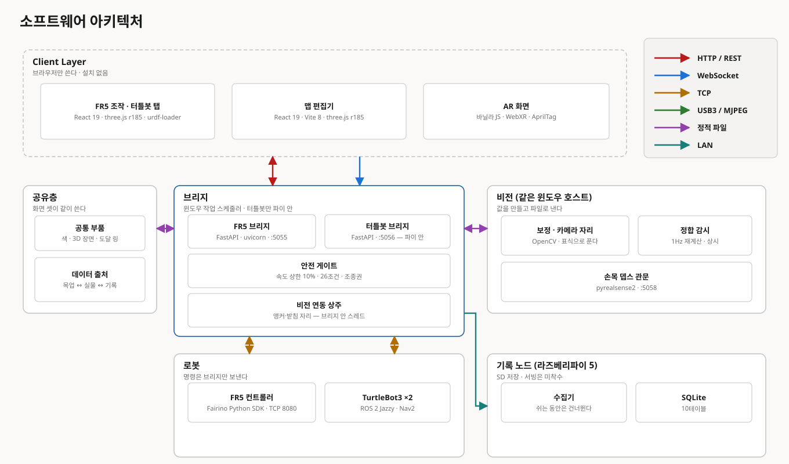
</p>

### 데이터 아키텍처

<p align="center">
  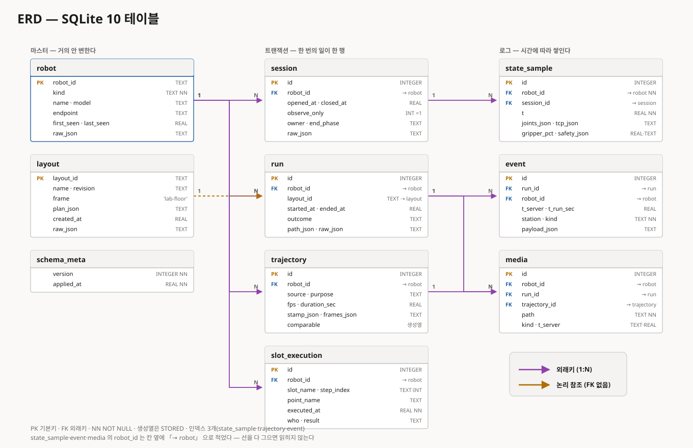
</p>

---

## 7. 시나리오

### 7.1 {{조립 사이클}} 시나리오

1. 조작자가 브라우저에서 브리지에 접속하고 조종권을 받습니다.
2. 브리지가 observe-only preflight 로 로봇 프로파일·SDK 버전을 대조합니다.
3. 조작자가 `현장확인` 을 입력해 명령 승격(ARM)합니다.
4. {{AMR 이 거치대를 싣고 작업 위치에 도착해 정지합니다.}}
5. 브리지가 AMR 정지(조건 27)를 확인한 뒤에만 팔 명령을 받습니다.
6. 손목 뎁스카메라가 거치대를 찾고, 거울 쌍 관측으로 파지점을 확정합니다.
7. 조작자가 「다음 칸 ▶」 으로 한 구간씩 실행하고 현장확인을 기록합니다.
8. {{파지 → 이송 → 놓기}} 가 끝나면 실행 기록이 jsonl 로 남습니다.
9. {{AMR 이 다음 스테이션으로 이동합니다.}}

### 7.2 배치 비교 시나리오

1. 관제 화면에서 배치안(팔·작업대·AMR 경로)을 편집합니다.
2. 같은 작업을 배치안별로 시뮬레이션에 넣어 시퀀스 타임과 여유(mm)를 받습니다.
3. 지표를 나란히 비교하고 출처 배지(sim / measured)를 확인합니다.
4. 채택한 배치안을 폰 AR 로 실물 바닥 위에 겹쳐 통로·작업대 충돌을 확인합니다.

### 7.3 위험 감지와 복구 시나리오

1. 조작자 정지 요청, 연결 손실, 조종권 상실, {{사람 접근}} 중 하나가 발생합니다.
2. `stop` 은 잠금·조종권과 무관하게 즉시 통과하고 서보를 멈춥니다.
3. 조종권이 사라지면 브리지가 자동으로 DISARM 합니다.
4. 화면은 어떤 조건이 막았는지 사유 코드로 표시합니다.
5. 조작자가 현장을 확인하고 다시 `현장확인` 으로 승격한 뒤 재개합니다.

---

## 8. 시퀀스 다이어그램

### 8.1 Sequence Diagram — {{조립 사이클}}

<p align="center">
  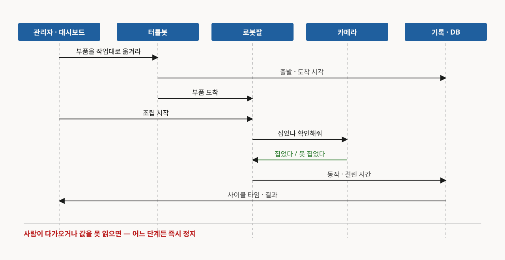
</p>

### 8.2 Sequence Diagram — {{배치 비교}}

<p align="center">
  
</p>

### 8.3 Sequence Diagram — 정지와 복구

<p align="center">
  
</p>

## 9. 상태 다이어그램

### 9.1 State Diagram — 브리지 조종권·승격 상태

<p align="center">
  
</p>

### 9.2 State Diagram — 시뮬 사이클

<p align="center">
  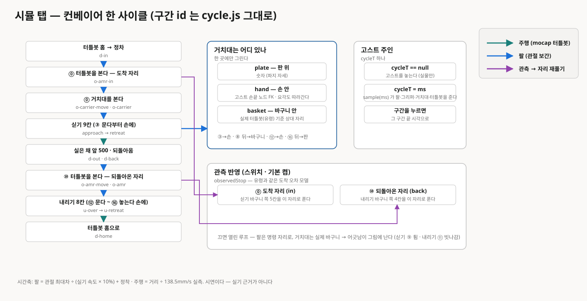
</p>

### 9.3 State Diagram — {{AMR 상태}}

<p align="center">
  
</p>

## 10. 작업 셀 맵, 요소 지점

<p align="center">
  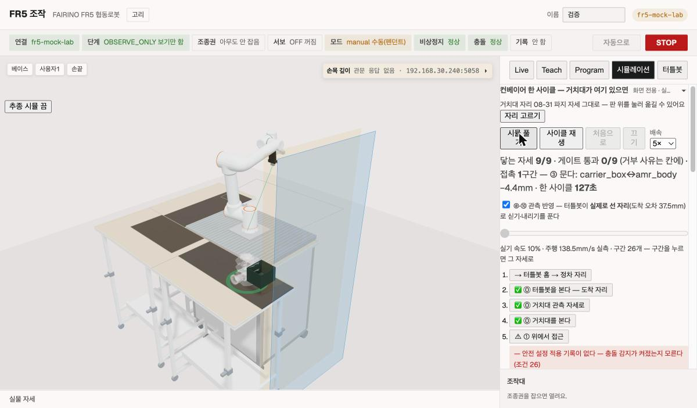
</p>

## 10-1. 화면

<table width="100%">
  <tbody>
    <tr>
      <td width="50%">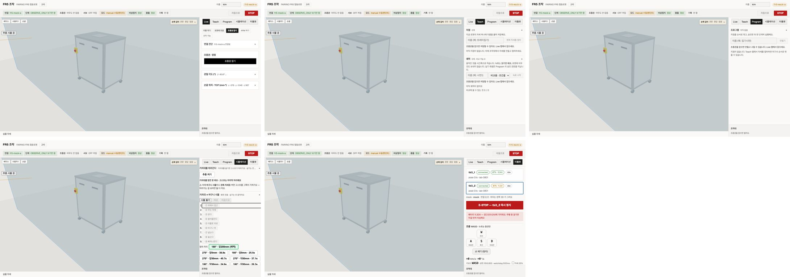<br><sub>웹 티칭 펜던트 — Live · Teach · Program · 시뮬 · 터틀봇</sub></td>
      <td width="50%">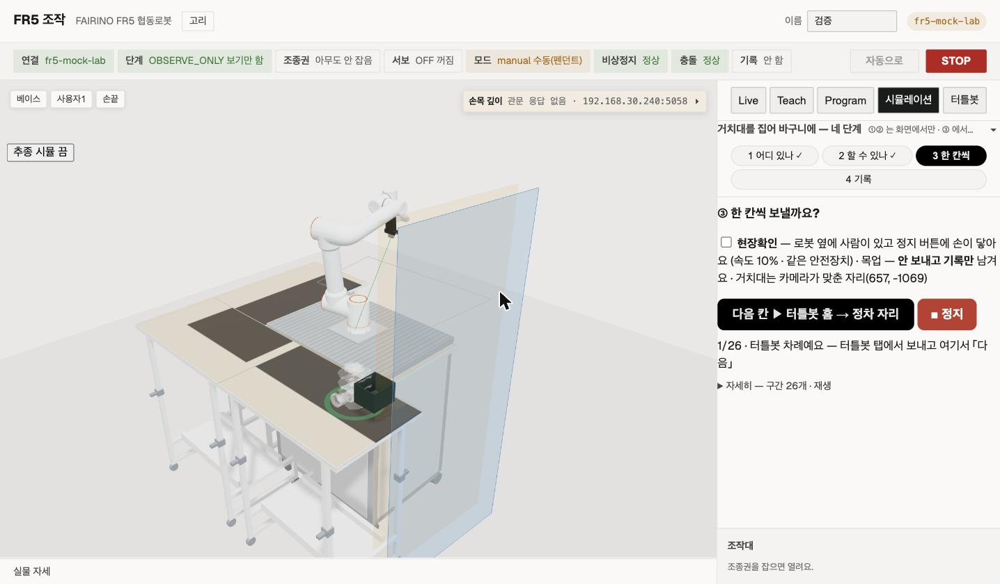<br><sub>시뮬 탭 4단 마법사 — 한 칸씩 실행·현장확인</sub></td>
    </tr>
    <tr>
      <td>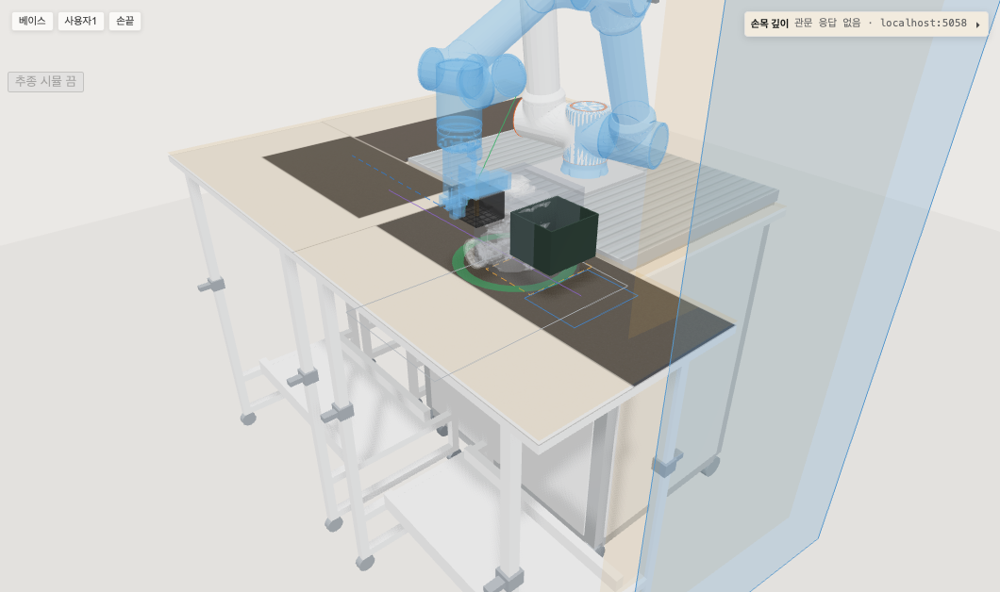<br><sub>MuJoCo 시뮬 — 들기 단계 접촉·여유 판정</sub></td>
      <td>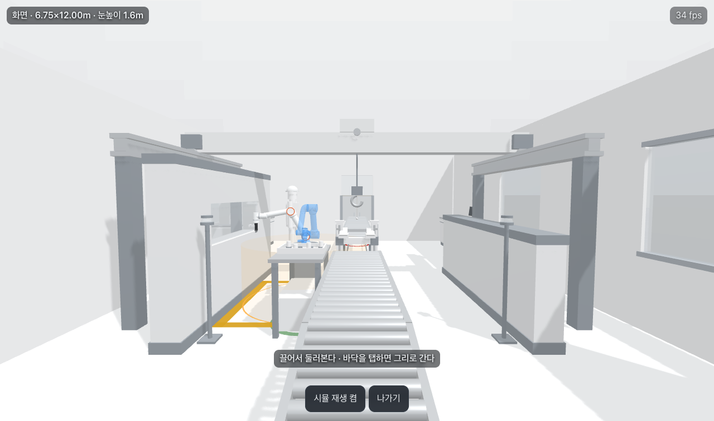<br><sub>WebXR — 실물 위 고스트 팔·예정 경로</sub></td>
    </tr>
    <tr>
      <td>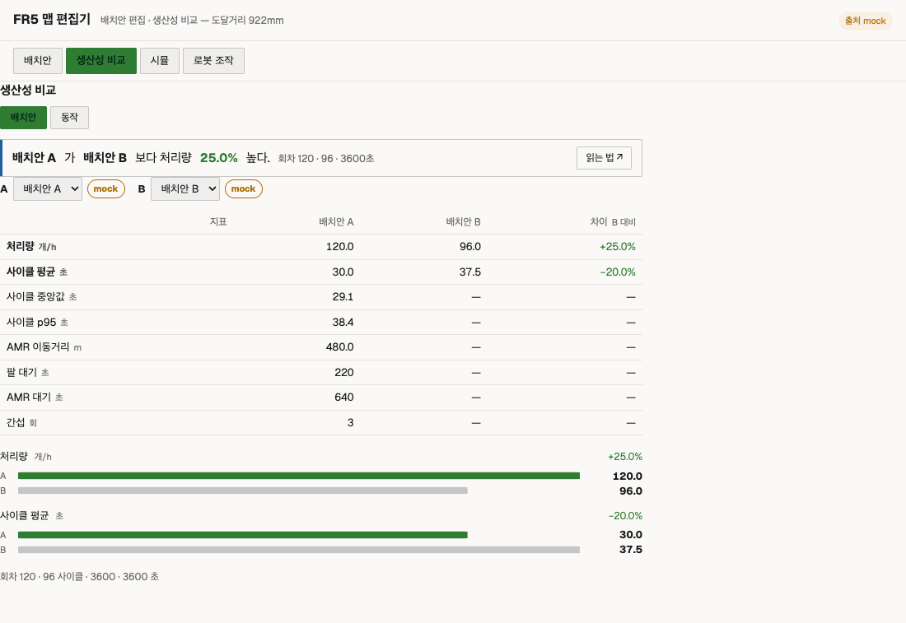<br><sub>관제화면 — 배치안별 지표 비교 (출처 배지)</sub></td>
      <td>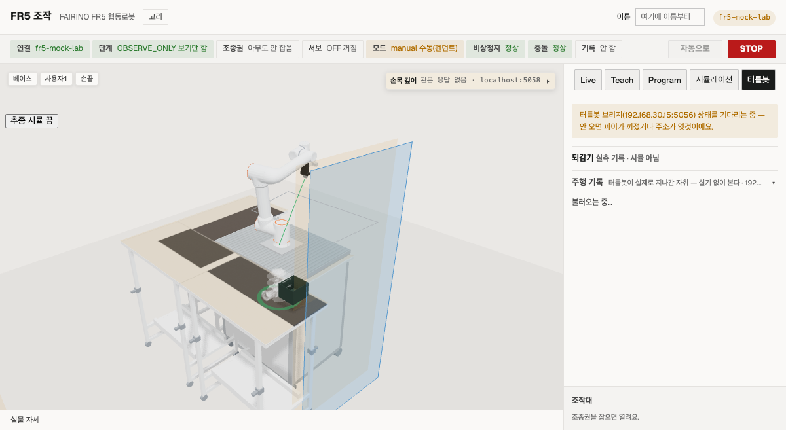<br><sub>터틀봇 탭 — 주행 기록</sub></td>
    </tr>
  </tbody>
</table>

## 11. 소스 구성

```text
.
├── fr5-web/            # 웹 작업대 — FR5 브리지·펜던트·AR/XR·관제·시뮬·TB/Vision 브리지
│   ├── FR5/            #   웹 티칭 펜던트(React) + bridge/ (FastAPI · 유일한 명령 관문)
│   ├── AR/             #   폰 AR/XR 겹쳐 보기 (Vite + 바닐라 three)
│   ├── Dashboard/      #   배치안 편집·지표 비교 관제화면
│   ├── Shared/         #   데이터 계약·datasource·view3d·자산(URDF·STL·태그)
│   ├── Sim/            #   MuJoCo 판정·여유·파지 계측 러너
│   ├── TurtleBot/      #   tb-bridge (로봇 파이 안 · ROS 2 어댑터)
│   ├── Vision/         #   손목 D435 관문 (읽기 전용)
│   ├── Database/       #   SQLite 스키마·마이그레이션·보존
│   ├── scripts/        #   check(게이트) · dev · deploy · build · map · robot
│   └── docs/           #   product · contract · arch · runbook · DECISION-LOG
├── {{ros2-ws/}}        # {{팀원 — ROS 2 노드·Nav2·bringup}}
├── {{ai/}}             # {{팀원 — 검출·학습}}
├── docs/               # 통합 계약·운영 문서
└── assets/             # README·발표용 이미지·영상
```

{{각 폴더는 자체 README 와 책임 경계 문서를 가진다. 최상단 문서는 배경·E2E 시나리오·통합 결과만 설명하고, API·설정·운영 절차는 폴더별 문서에서 관리한다.}}

---

## 12. 통합 결과와 검증

### 12.1 E2E 시나리오 결과

{{기록된 통합 시나리오 설명 한 줄 — 어느 run_id 기준, 어느 날짜}}

<table width="100%">
  <tbody>
    <tr>
      <td width="64%" valign="top">
        <table width="100%">
          <thead><tr><th width="15%" nowrap>시나리오</th><th width="65%" nowrap>검증 내용</th><th width="20%" nowrap>결과</th></tr></thead>
          <tbody>
            <tr><td align="center" nowrap>S01</td><td nowrap>접속·조종권·명령 승격</td><td align="center" nowrap>PASS</td></tr>
            <tr><td align="center" nowrap>S02</td><td nowrap>실기 조그·티칭 지점 이동</td><td align="center" nowrap>PASS</td></tr>
            <tr><td align="center" nowrap>S03</td><td nowrap>거치대 검출·조준 (마법사 첫 이동 · 24초 · readback 0.0°)</td><td align="center" nowrap>PASS</td></tr>
            <tr><td align="center" nowrap>S04</td><td nowrap>AMR 정지 확인 후 팔 명령 (조건 27)</td><td align="center" nowrap>PASS</td></tr>
            <tr><td align="center" nowrap>S05</td><td nowrap>{{파지·이송·놓기}}</td><td align="center" nowrap>{{PASS/미실행}}</td></tr>
            <tr><td align="center" nowrap>S06</td><td nowrap>정지·복구</td><td align="center" nowrap>{{PASS}}</td></tr>
            <tr><td align="center" nowrap>S07</td><td nowrap>AR 겹쳐 보기 정합</td><td align="center" nowrap>{{PASS}}</td></tr>
          </tbody>
        </table>
      </td>
      <td width="36%" valign="top">
        <table width="100%">
          <thead><tr><th width="58%" nowrap>통합 지표</th><th width="42%" nowrap>결과</th></tr></thead>
          <tbody>
            <tr><td nowrap>전체 시나리오</td><td nowrap>{{n}}/7</td></tr>
            <tr><td nowrap>hand-eye 흩어짐</td><td nowrap>5.74 mm</td></tr>
            <tr><td nowrap>거치대 요각 안정도</td><td nowrap>1.4° / 1.1°</td></tr>
            <tr><td nowrap>E2E 실행 시간</td><td nowrap>{{m분 s초}}</td></tr>
            <tr><td nowrap>{{지표}}</td><td nowrap>{{값}}</td></tr>
          </tbody>
        </table>
      </td>
    </tr>
  </tbody>
</table>

### 12.2 검증 계층

<table width="100%">
  <thead><tr><th width="25%" nowrap>검증 구분</th><th width="45%" nowrap>확인 범위</th><th width="30%" nowrap>증명하지 않는 범위</th></tr></thead>
  <tbody>
    <tr><td nowrap>단위 테스트</td><td nowrap>안전 게이트·조종권·좌표 사슬·데이터 계약 (Shared 309 · 브리지 246)</td><td nowrap>실제 로봇의 물리 동작</td></tr>
    <tr><td nowrap>브리지 왕복 (mock)</td><td nowrap>API ↔ 브리지 ↔ 목업 어댑터 125건</td><td nowrap>SDK 실기 응답·지연</td></tr>
    <tr><td nowrap>실렌더 (headless Chrome)</td><td nowrap>Live·Teach·Program·시뮬 탭·AR/XR 화면 (web 99 · sim-tab 64 · ar 82 · dash 143)</td><td nowrap>폰 카메라 권한·실물 조명</td></tr>
    <tr><td nowrap>시뮬레이션 (MuJoCo)</td><td nowrap>작업영역 판정·접촉·여유·파지 기하 (FK 2000자세 실기 판정과 동일)</td><td nowrap>실물 센서 오차·마찰·하중</td></tr>
    <tr><td nowrap>실물 기능 검증</td><td nowrap>조그·티칭·거치대 검출·조준·AMR 연동</td><td nowrap>장시간·반복 운용 안정성</td></tr>
    <tr><td nowrap>실물 E2E</td><td nowrap>{{조립 사이클 전체}}</td><td nowrap>모든 조명·배치·장애물 조건</td></tr>
  </tbody>
</table>

목업과 시뮬 통과를 실물 합격으로 쓰지 않습니다. 화면의 모든 수치는 출처 배지(mock / sim / measured)를 달고, 측정값은 날짜·방법·조건과 함께 `fr5-web/docs/` 에 보존합니다.

---

## 13. 빠른 시작

### 13.1 하드웨어 없이 (mock)

```bash
cd fr5-web
cp .env.example .env
npm install                       # workspaces — 처음 한 번
node scripts/build/config.mjs     # .env → Shared/data/config/*.json
bash scripts/dev/fr5-dev.sh       # mock 브리지(:5055) + 펜던트(:5176)
bash scripts/check/all.sh --fast  # 게이트 21개 · 실렌더 제외
```

API·안전 게이트·조종권·좌표 사슬·데이터 계약을 확인하며 실제 로봇 동작은 포함하지 않습니다.

### 13.2 화면 주소

<table width="100%">
  <thead><tr><th width="30%" nowrap>화면</th><th width="30%" nowrap>주소</th><th width="40%" nowrap>범위</th></tr></thead>
  <tbody>
    <tr><td nowrap>웹 티칭 펜던트</td><td nowrap><code>FR5/</code> · <code>:5176</code></td><td nowrap>Live · Teach · Program · 시뮬 · 터틀봇 탭</td></tr>
    <tr><td nowrap>관제화면</td><td nowrap><code>Dashboard/</code> · <code>:5187</code></td><td nowrap>배치안 편집 · 지표 비교</td></tr>
    <tr><td nowrap>AR 겹쳐 보기</td><td nowrap><code>AR/ar.html</code> · <code>xr.html</code></td><td nowrap>폰 카메라 · WebXR</td></tr>
    <tr><td nowrap>{{팀원 화면}}</td><td nowrap>{{주소}}</td><td nowrap>{{범위}}</td></tr>
  </tbody>
</table>

### 13.3 실물 통합 시작

실물 운용은 {{Robot SBC → Vision → FR5 Bridge → 화면}} 순서로 시작합니다. 브리지는 observe-only 로 붙고, 명령 승격(ARM)은 사람이 화면에서 `현장확인` 을 입력해야 됩니다.

```bash
# TurtleBot (로봇 파이)
bash fr5-web/scripts/deploy/tb-pi.sh          # tb-bridge systemd (:5056)

# Vision (우분투 · D435)
bash fr5-web/scripts/deploy/cam-ubuntu.sh     # 카메라 관문 (:5058)

# FR5 Bridge + 빌드된 화면 (우분투 또는 윈도우 호스트)
bash fr5-web/scripts/deploy/fr5-ubuntu.sh     # 브리지 + 정적 서빙 (:5055)
#   윈도우: fr5-web/scripts/deploy/fr5-bridge.win.cmd

# {{팀원 — ROS 2 bringup}}
{{ros2 launch ...}}
```

실물 명령 전 상태를 확인합니다.

```bash
bash fr5-web/scripts/dev/health.sh            # 브리지·카메라·TB 연결 고리
```

`connected`, `owner`, `armed`, AMR `motion_status = stopped`, 카메라 신선도가 모두 정상일 때만 실물 명령을 보냅니다. 종료 전에는 `stop` → DISARM → 조종권 해제 순서를 지킵니다.

---

## 14. 현재 한계와 확장 목표

<table width="100%">
  <thead><tr><th width="46%" nowrap>현재 확보한 기반</th><th width="54%" nowrap>다음 목표</th></tr></thead>
  <tbody>
    <tr><td nowrap>브리지 단일 관문 · 조종권 1인 · fail-closed 안전 게이트</td><td nowrap>{{다중 로봇 조종권 · 역할별 권한}}</td></tr>
    <tr><td nowrap>마법사 4단(거치대 찾기 → 신호등 → 한 칸씩 → 기록)으로 실기 첫 이동</td><td nowrap>파지·이송·놓기 전 사이클 실기 완주</td></tr>
    <tr><td nowrap>hand-eye 5.74mm · 거울 쌍 관측으로 회전 편향 상쇄</td><td nowrap>고정 편향 킬실험(rz / rz+180 × 3자리) 로 정밀 단 확정</td></tr>
    <tr><td nowrap>목업·시뮬·실기 3층 분리와 출처 배지</td><td nowrap>시뮬 ↔ 실기 시퀀스 타임 대조 자동화</td></tr>
    <tr><td nowrap>AR 마커 정합 · WebXR 고스트 팔</td><td nowrap>{{글로벌 카메라 정합 상시화 · 조명 조건 반복 검증}}</td></tr>
    <tr><td nowrap>{{기반}}</td><td nowrap>{{목표}}</td></tr>
  </tbody>
</table>

{{현재 결과는 지정된 셀과 장비에서 확보한 프로젝트 검증 결과입니다. 산업 현장 적용을 주장하기보다 … 범위로 정의합니다.}}

---

## 15. 프로젝트 타임라인

### {{Jira / 이슈}} 작업 이력

<p align="center">
  
</p>

**프로젝트 기간 [ {{2026년 M월 D일}} ~ 2026년 9월 17일 ]**

## 16. 프로젝트 기술 스택

### Robot & Middleware


### Perception & Simulation


{{}}

### Backend & Data


### Frontend & AR


### Integration & Validation


### 협업·프로젝트 관리

{{}}
{{}}


- **{{Jira}}** : 프로젝트 일정 관리
- **{{Notion / Confluence}}** : 기술 문서 관리
- **{{Slack / 카카오톡}}** : 팀 커뮤니케이션
- **GitHub** : 원격 코드 협업
- **Git** : 변경 이력 추적

---

## 17. 보안 및 제외 항목

실제 환경에서는 사용하지만 저장소에는 포함하지 않는 항목입니다.

- 기계별 `.env` (마커 실측·그리퍼 장착값·호스트 주소) — 형식은 `fr5-web/.env.example`
- 브리지가 발급하는 조종권 토큰과 로컬 실행 기록 (`~/fr5-data/`)
- 캘리브레이션 원본 사진 (`calib-shots/*` · 유도값 `tag-layout.json` 만 보존)
- 시뮬 산출물 (`Sim/out/`) 과 시네마틱 렌더 중간 프레임 — 다시 구우면 같은 결과
- {{SSH 개인 키 · 장비 로그인 정보 · Supabase 키(보류)}}
