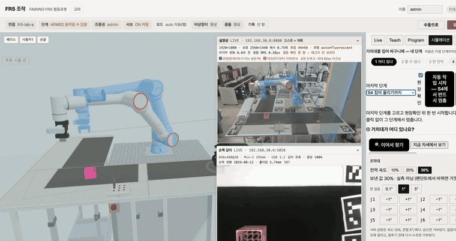
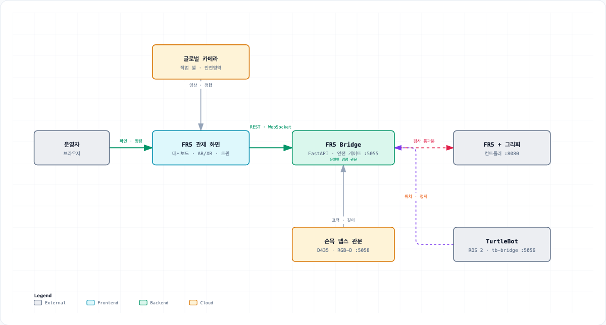
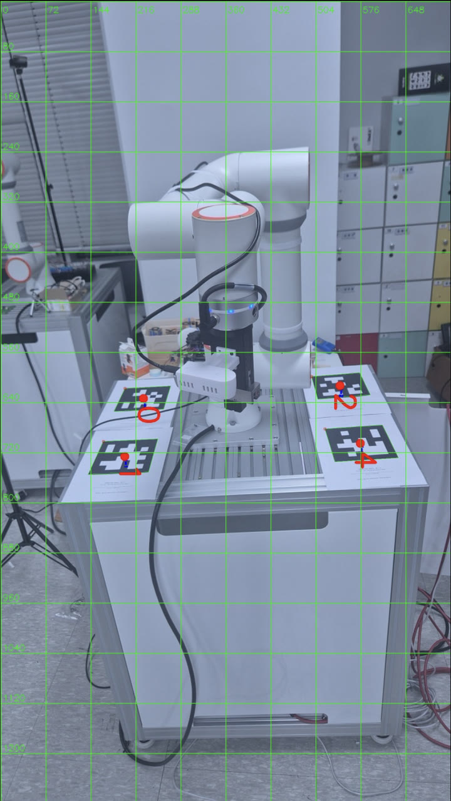
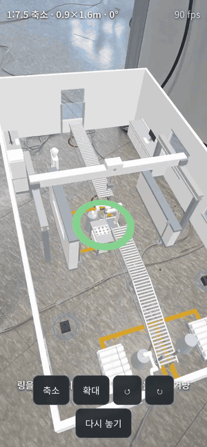
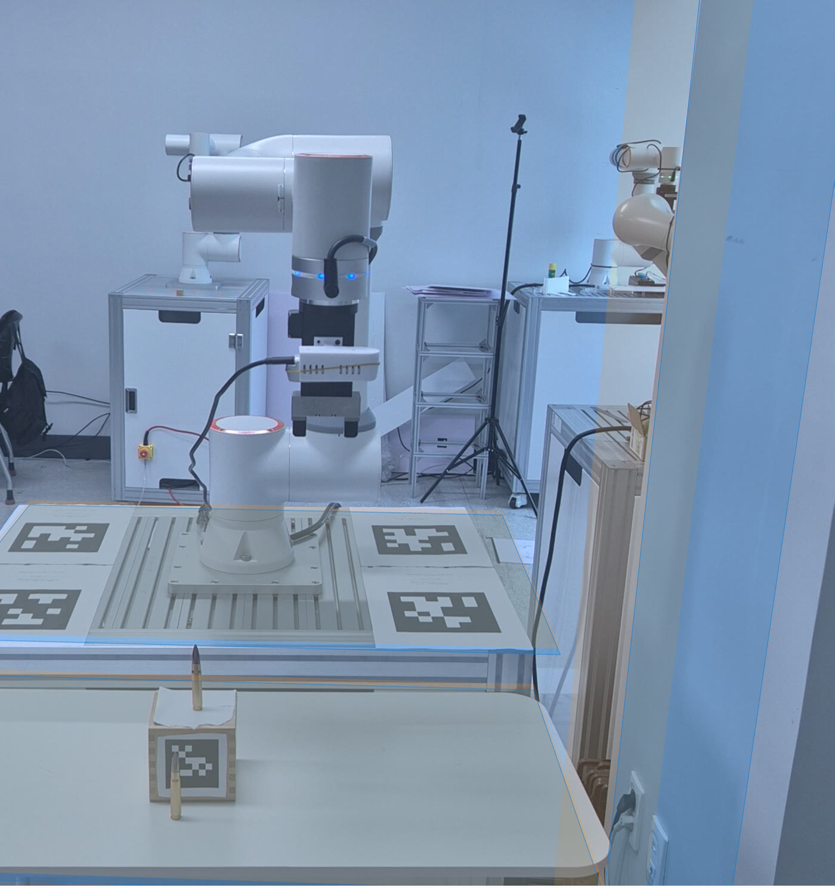
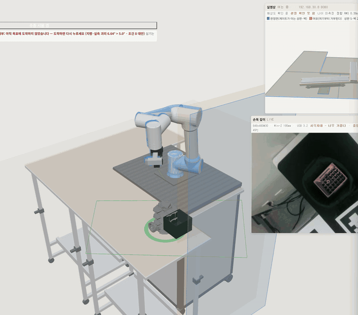
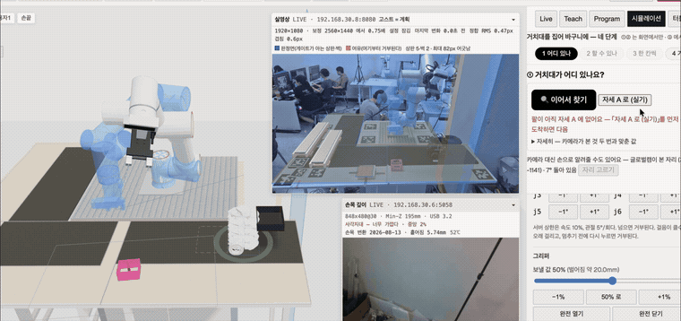
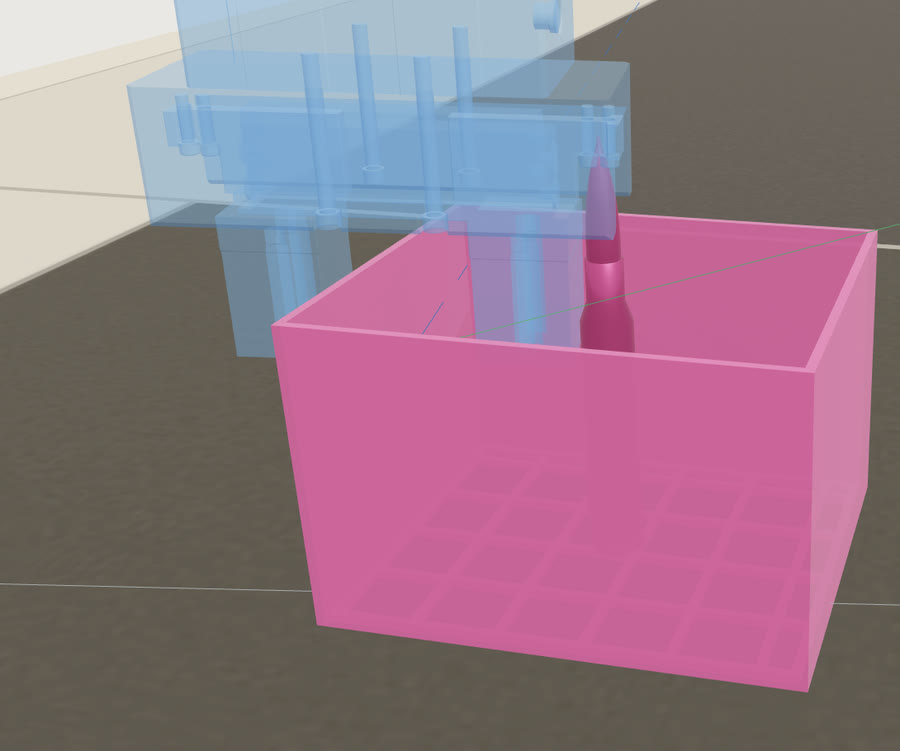
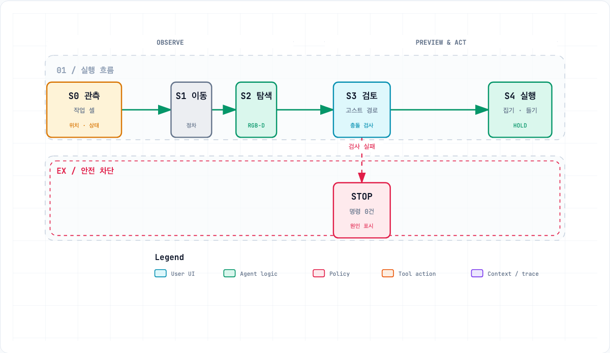

# FR5 × TurtleBot 작업 셀 디지털 트윈

글로벌 카메라와 손목 뎁스카메라로 작업 셀을 보고, 디지털 트윈에서 이동 경로와 충돌을 먼저 확인한 뒤 FAIRINO FR5가 TurtleBot이 가져온 거치대를 집는 프로젝트입니다.

<p align="center">
  
</p>

> 위 GIF는 2026-09-10 실기 화면을 6배속으로 편집한 자료입니다. 배속은 실제 로봇 속도나 사이클 시간을 뜻하지 않습니다.

## 프로젝트 개요

### 문제

- 작업대를 옮긴 뒤에야 로봇의 도달 범위와 통로 간섭을 알 수 있었습니다.
- 이동한 TurtleBot과 거치대를 다시 찾지 못하면 로봇팔 목표가 곧 낡았습니다.
- 숫자만 있는 계획으로는 실제 장비가 어디로 움직일지 발표자와 평가자가 함께 확인하기 어려웠습니다.

### 목표

1. 작업 셀을 브라우저에서 편집하고 실제 공간에 AR로 겹쳐 봅니다.
2. 글로벌 카메라와 손목 RGB-D로 이동한 로봇과 작업물을 다시 관측합니다.
3. 예정 자세를 고스트와 경로로 먼저 보여주고, 안전 검사를 통과한 동작만 FR5에 전달합니다.

### 현재 도달점

| 날짜 | 확인한 결과 | 검증 범위 |
|---|---|---|
| 2026-09-04 | 글로벌 카메라 없이 손목 뎁스로 TurtleBot을 재획득하고 FR5가 10걸음 추종 | TurtleBot 917mm 이동, 목표 대비 손끝 XY 오차 1mm 이내, 거부 0. 파지는 하지 않음 |
| 2026-09-07 | 예정 자세를 트윈과 글로벌 카메라 위에 함께 표시 | 한 자세에서 팁 정합 약 8–10px. 반복 정밀도 주장은 하지 않음 |
| 2026-09-10 | 거치대와 내부 총알을 관측하고 충돌 없는 벽을 골라 접근→파지→들기 완주 | 지정 작업 셀의 1회 실기 성공. 장시간 반복 운용과 놓기는 아직 범위 밖 |
| 2026-09-11 | S2 자동 재탐색, 폰 AprilTag 자세, 화면 간 공동 고스트를 코드에 연결 | 로컬 단위·실렌더 검증만 완료. 새 실기 배포·촬영 전 |

## 팀 구성

| 팀원 | 담당 | 주요 역할 |
|---|---|---|
| 김주영 | Web · Cobot Bridge · AR | FR5 웹 조작, 안전 관문, 디지털 트윈, AR/XR, TurtleBot 연동 |
| 백은주 | 강화학습 | 조립 작업 정책 학습과 평가 |
| 김선일 | 3D 프린팅 · 모방학습 | 핑거·브래킷·거치대 제작, 시연 데이터 기반 정책 개발 |
| 박인한 | Vision | 작업물·거치대 검출, 카메라 보정, 검출 결과 연동 |

## 시스템 구조

<p align="center">
  
</p>

핵심 원칙은 단순합니다. 브라우저와 센서는 로봇에 직접 명령하지 않고, 모든 FR5 명령은 `FR5/bridge`의 조종권·상태·안전 검사를 거칩니다.

| 구성 | 하는 일 | 경계 |
|---|---|---|
| `Dashboard/` | 작업 셀 맵 편집, 배치·시뮬 결과 비교 | 로봇 명령을 보내지 않음 |
| `AR/` | 마커 AR, 글로벌 카메라 겹치기, WebXR 현장 답사 | 실물 영상과 가상 배치를 같은 좌표로 표시 |
| `FR5/src/` | Live·Teach·Program·시뮬·TurtleBot을 한 화면에서 운영 | 화면은 안전 판정을 대신하지 않음 |
| `FR5/bridge/` | FAIRINO SDK, 조종권, 상태 방송, 안전 게이트 | FR5의 유일한 명령 관문 |
| `Vision/` | 손목 D435의 RGB-D 프레임과 측정값 제공 | 관측만 하며 로봇에 명령하지 않음 |
| `TurtleBot/` | ROS 2 상태·이동 슬롯을 HTTP/WS 계약으로 노출 | FR5 관문과 분리된 로봇별 관문 |
| `Sim/` | MuJoCo 기반 IK·작업영역·접촉 검토 | 시뮬 통과를 실기 성공으로 쓰지 않음 |

다이어그램의 편집 가능한 원본은 [`assets/diagrams/fr5`](assets/diagrams/fr5)에 있습니다.

## 기능이 발전한 순서

전체 커밋·자료 대조표는 [FR5 통합 기능·증거 타임라인](docs/FR5-EVIDENCE-TIMELINE.md)에 정리했습니다.

### 1. 좌표 기준을 먼저 세움 — 07-31

처음에는 카메라 화면에서 로봇을 보여주는 데 집중했습니다. 이후 작업대의 AprilTag를 검출해 “화면의 로봇이 어디에 서 있는가”를 셀 좌표로 설명할 수 있게 만들었습니다.

<p align="center">
  
</p>

### 2. 맵 편집 결과를 현장으로 가져감 — 08-05~13

화면에서만 보던 작업 셀 맵을 바닥 AR로 불러왔습니다. 작업대 세 개와 안전영역도 같은 좌표 사슬에 넣어, 옮기기 전에 통로와 간섭을 확인하는 구조로 확장했습니다.

<table width="100%">
  <tr>
    <td width="35%" align="center"></td>
    <td width="65%" align="center"></td>
  </tr>
  <tr>
    <td align="center"><sub>맵 편집 결과를 바닥에 배치</sub></td>
    <td align="center"><sub>실제 영상 위 작업대·안전영역 정합</sub></td>
  </tr>
</table>

### 3. 이동한 TurtleBot을 다시 찾아 추종 — 08-28~09-04

처음에는 시뮬레이션 고스트만 TurtleBot을 따라갔습니다. 이후 손목 뎁스 재획득과 바퀴 위치 대조를 연결해, 글로벌 카메라가 없어도 실제 FR5가 이동한 TurtleBot을 따라가도록 바꿨습니다.

<p align="center">
  
</p>

### 4. 이동 경로를 실행 전에 보이게 함 — 09-07

AR은 장식이 아니라 실행 전 검토 화면으로 바뀌었습니다. 예정 자세를 반투명 고스트로 그리고, 글로벌 카메라 화면에서도 실제 장비와 이동 방향을 함께 확인합니다.

<p align="center">
  
</p>

### 5. 거치대 안의 총알까지 포함해 집기 — 09-09~10

거치대 중심만 향하면 그리퍼가 내부 총알과 부딪힐 수 있었습니다. RGB-D로 거치대와 총알을 함께 찾고, 잡을 벽 후보를 `IK → 작업영역 → MuJoCo 접촉` 순서로 검사한 뒤 통과한 계획만 실기로 보냈습니다.

<p align="center">
  
</p>

## S0–S4 제한 자동 실행

<p align="center">
  
</p>

| 단계 | 입력과 판단 | 화면·실기의 결과 |
|---|---|---|
| S0 관측 | 글로벌 카메라, FR5·TurtleBot 상태 | 셀 좌표와 장치 상태를 한 화면에 모음 |
| S1 이동 | TurtleBot 목표와 정차 상태 | AMR이 멈춘 뒤에만 다음 단계 허용 |
| S2 탐색 | 손목 RGB-D, 거치대·총알 후보 | 이동 후 현재 위치에서 표적을 다시 찾음 |
| S3 검토 | 고스트, IK, 작업영역, 접촉 | 실패하면 원인을 표시하고 FR5 명령은 0건 |
| S4 실행 | 승인된 접근·파지 자세 | 접근 → 70% 사전 성형 → 4% 파지 → 안전 높이까지 들기 |

## 기술 구성

- Robot: FAIRINO FR5, PGEA-100-40, TurtleBot3 Burger
- Perception: RealSense D435, 글로벌 카메라, OpenCV, AprilTag
- Backend: Python, FastAPI, REST, WebSocket, FAIRINO Python SDK
- Frontend: React 19, Vite 8, three.js, urdf-loader, AR.js, WebXR
- Simulation: MuJoCo, URDF/MJCF, 브라우저 실렌더 검사
- Middleware: ROS 2, TurtleBot별 bridge

## 빠른 시작

하드웨어 없이 화면과 목업 관문을 띄우는 최소 경로입니다.

```bash
cd fr5-web
cp .env.example .env
npm install
npm run config
bash scripts/dev/fr5-dev.sh
```

- FR5 화면: `http://localhost:5176`
- FR5 Bridge: `http://localhost:5055`
- Dashboard: `npm run dev:dash` 후 `http://localhost:5187`
- AR 화면: `npm run dev:ar`

빠른 검증은 다음 명령으로 실행합니다.

```bash
cd fr5-web
bash scripts/check/all.sh --fast
```

실물 연결·배포 순서는 [`fr5-web/docs/ref/runbook/FR5-BRINGUP.md`](fr5-web/docs/ref/runbook/FR5-BRINGUP.md)를 따릅니다. 로봇 명령 전에는 조종권, ARM 상태, 속도 상한, TurtleBot 정차, 카메라 신선도를 확인해야 합니다.

## 현재 한계와 다음 확장

- `fr5-web`은 원본 `e24901f` 이후의 09-11 작업 트리를 17:36~17:43에 기능 단위로 동기화했습니다. 정확한 범위와 제외 항목은 [`migration-manifest.yaml`](fr5-web/docs/migration-manifest.yaml)에 있습니다.
- S2 자동 재탐색은 `250mm 같은 각 → 225mm 같은 각 → 250mm +90° → 250mm -90°` 후보 안에서 최대 4회 이동·12회 촬영으로 제한됩니다. 로컬 검증은 통과했지만 새 실기 배포·촬영 전입니다.
- S4의 집기·들기는 한 작업 셀에서 확인했습니다. S5 이후 운반·놓기·반복 사이클은 완료로 표시하지 않습니다.
- 09-07 고스트 정합은 한 자세의 화면 비교입니다. 다양한 자세·조명에서의 반복 오차는 더 측정해야 합니다.
- 2026-09-11 동기화 후 빠른 게이트는 `grasp-rank`, `sim-batch` 두 검사만 기존 실측·픽스처 차이로 실패했습니다. `agree`는 로봇이 연결되지 않아 판정 재료가 없었습니다. FR5 전체 실렌더는 두 번 실행해 107/110, 109/110으로 타이밍 민감 항목이 서로 다르게 실패했습니다.

README용 파생 이미지의 원본명·배속·주장은 [`source-manifest.json`](assets/media/fr5/source-manifest.json)에 남겼습니다. 원본 영상은 수정하지 않았습니다.

## 저장소 구조

```text
.
├── fr5-web/
│   ├── Dashboard/    # 작업 셀 맵 편집·비교
│   ├── AR/           # 마커 AR·글로벌 카메라·WebXR
│   ├── FR5/          # 웹 조작 화면 + 안전 브리지
│   ├── Vision/       # 손목 D435 관문
│   ├── TurtleBot/    # ROS 2 상태·이동 관문
│   ├── Sim/          # MuJoCo 검토
│   ├── Shared/       # 좌표·화면·자산 공용부
│   ├── scripts/      # 빌드·검사·배포·현장 도구
│   └── docs/         # 계약·설계·운영 문서
├── assets/
│   ├── diagrams/fr5 # 다이어그램 JSON·HTML·PNG
│   └── media/fr5/    # README용 사진·배속 GIF·출처 목록
└── docs/             # 통합 증거 타임라인
```
