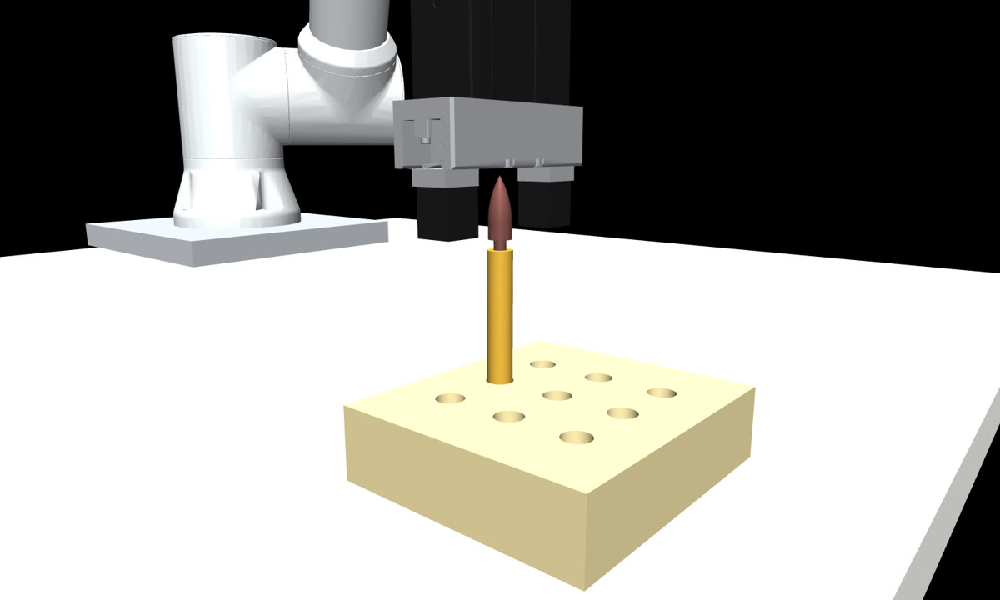
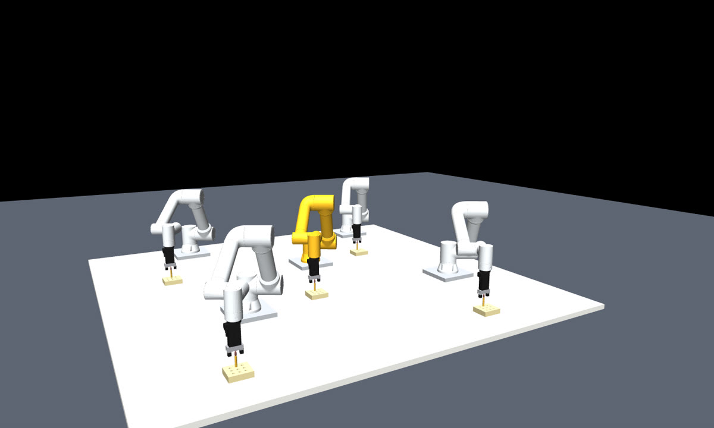

# fr5-screw-rl

FAIRINO FR5 협동로봇이 **탄두를 탄피에 돌려 끼우는** 작업을 PPO 로 학습한다.
[`vision-pick-and-place/sam3/`](../vision-pick-and-place/sam3/) 가 파지까지 하고 넘긴 지점부터다.

## 무엇이 어려운가

착좌까지 **6.25 바퀴**가 필요하다 — 회전으로 넣어야 할 5.00mm 를 나사 피치 0.8mm 로 나눈 값이다.
그런데 j6 가동범위가 ±175° 라, 여유 3° 를 빼고 쓰면 한 스트로크가 **344° = 0.956 바퀴**뿐이다.
**한 바퀴가 안 된다.**

```
6.25 바퀴 ÷ 0.956 바퀴 = 6.54 스트로크
스트로크 사이마다  그리퍼 열기 → 손목 되감기 → 다시 잡기  (재파지 6회)
```

일반적인 peg-in-hole 과제에 없는 제약이고, 이 저장소의 나머지 작업과 구분되는 지점이다.

## 실행 화면



실측 치수로 세운 씬. 구멍 뚫린 고정대에 탄피가 5mm 꽂혀 있고, 그리퍼가 탄두를 물고 있다.


체결 중. 탄두가 회전하며 탄피 안으로 들어간다. 축방향 전진은 **오직 회전으로만** 일어난다.



5대 동시 재생. 가운데 금색이 선정 정책이고, 나머지 넷은 보상 항목을 하나씩 제거한 대조군이다
(접근 실패 · 문지름 · 호버링 · 회전 부족).


동일 조건 15회 학습. 굵은 선이 중앙값이다. 15회 모두 10만 스텝까지 0% 이고,
첫 100% 도달이 12.5만~27.5만으로 흩어진다.

## 모듈 경계

이 저장소에서 가장 헷갈리기 쉬운 부분이다. **세 층이 서로 다른 것에 의존한다.**

| 층 | 파일 | 의존 | 로봇을 움직이나 |
|---|---|---|---|
| **학습 환경** | `fr5_screw_assembly.py` | `numpy` · `gymnasium` **만** | 아니오 |
| **학습·평가** | `train_screw_ppo.py` · `train_failure_exhibit.py` · `tune_screw_ppo.py` | 위 + `stable-baselines3` | 아니오 |
| **시각화** | `verify_screw_policy.py` · `record_screw_video.py` · `view_*.py` | MuJoCo (렌더) | 아니오 |
| **기하 검사** | `selfcheck.py` | MuJoCo (충돌·FK) | 아니오 |
| **실기 — 정책 실행** | `fr5_execute_policy.py` | MuJoCo(IK) + **ROS 2 브리지** | **예** |
| **실기 — 도구** | `screw_stroke_cycle.py` · `go_home.py` · `measure_min_step.py` · `verify_collision_stop.py` · `fr5_screw_in.py` · `fr5_assemble_sdk.py` | **fairino SDK 직결** | **예** |
| **실측값** | `fr5_site.py` · `task_origin.json` | 없음 | 아니오 |

### 학습 환경과 MuJoCo 는 역할이 나뉜다

학습 환경(`fr5_screw_assembly.py`)은 `numpy` 와 `gymnasium` 만으로 돈다.
나사 결합의 지배 관계 `전진 = 회전 × 피치 ÷ 2π` 를 **해석식으로 풀기 때문이다.**

MuJoCo 는 **역기구학 · 자기충돌 검사 · 렌더링**을 맡는다. 접촉 파라미터
(`solimp` · `solref` · `friction`)는 학습에 관여하지 않으며, MJCF 에는 액추에이터가 없다.

역할을 이렇게 나눈 덕에 30만 스텝 학습 1회가 **1분**에 끝나,
동일 조건 15회 반복 검증이 가능했다.

### 실기 접근 경로가 둘이다

```
fr5_execute_policy.py  ──→  fr5_real_bridge.py  ──→  ROS 2  ──→  로봇
그 외 실기 스크립트     ──→  fairino_sdk.Robot   ──→  XML-RPC 20003  ──→  로봇
```

**두 경로는 안전 검사가 다르다.** `fr5_real_bridge` 는 금지 명령 화이트리스트와
비상정지 감시, 바닥 가드를 갖는다. SDK 직결 스크립트는 각자 검사를 구현한다.
새 실기 스크립트를 쓸 때 어느 쪽을 따를지 먼저 정해야 한다.

## 로컬 실행

```bash
python3 -m venv .venv && source .venv/bin/activate
pip install -r requirements.txt
cd src
```

| 단계 | 명령 | 소요 | 로봇 |
|---|---|---|---|
| 학습 | `python3 train_screw_ppo.py --steps 300000` | 약 1분 | 불필요 |
| 대조군 생성 | `python3 train_failure_exhibit.py` | 약 3분 | 불필요 |
| 확인 | `python3 verify_screw_policy.py` | 약 8분 | 불필요 · **창 필요** |
| 녹화 | `python3 record_screw_video.py --steps 340` | 약 4분 | 불필요 |
| 종합표 | `python3 summarize_run.py` | 1분 내외 | 불필요 |
| 씬만 보기 | `python3 view_scene.py` · `view_fleet.py` | — | 불필요 · **창 필요** |

학습은 실행마다 `train_runs/<시각>/` 에 로그와 스냅샷을 남기고, 이전 기록을 지우지 않는다.
체크포인트는 2.5만 스텝마다 저장한다.

**단일 실행 결과로 정책을 고르지 말 것.** `record_screw_video.py` 와 `summarize_run.py` 가
`models_screw/` 의 모든 체크포인트를 20 에피소드씩 재평가해 **성공률 → 문지름** 순으로 고른다.

## 실물 운용

### 선행 조건 — 안 닫히면 실행이 거부된다

조립은 **조이는 방향**이라 실패가 과조임이고 되돌릴 수 없다.

| 게이트 | 상태 | 닫는 법 |
|---|---|---|
| 작업 원점 실측 | 닫힘 (2026-09-07) | `fr5_calibrate_task_origin.py --from-joints` |
| `ZSIGN_VERIFIED` | **열림** | `screw_stroke_cycle.py --strokes 1 --substeps 1 --zlift --vel 3 --run` 으로 눈으로 확인 |
| `COLLISION_STOP_VERIFIED` | **열림** | `verify_collision_stop.py --run` |

플래그는 `fr5_site.py` 에 있고 **사람이 직접 True 로 바꾼다.** 코드가 스스로 올리지 않는다.

### 순서

```bash
python3 go_home.py                  # --run 없이. 모드·고장·자세를 한 번에 확인
python3 go_home.py --run            # 원점 복귀
python3 measure_min_step.py --run   # 컨트롤러 최소 실행 이동량 측정 (그리퍼 비우고)
python3 fr5_execute_policy.py       # dry-run — 명령 시퀀스만 출력
python3 fr5_execute_policy.py --move    # 호버까지만
python3 fr5_execute_policy.py --grasp   # 전체 수행
```

### 실행 전 확인

- **탄두를 그리퍼에 물려 둘 것.** 스크립트는 집으러 가지 않는다
- **시작 자세를 탄피 근처에 둘 것.** j6 허용 상자(탄피에서 ±300mm · 책상 위 20~700mm)를
  벗어나면 거부된다
- 탄피가 `task_origin.json` 의 자리에 있는지 확인. **비전이나 탐색이 없다**
- 다른 사람이 쓴 뒤라면 모드가 수동으로 바뀌어 있거나 상태 포트(20004)가 죽어 있을 수 있다

### 사고 이력에서 나온 방어

| 검사 | 계기 |
|---|---|
| 첫 이동 경로 26점 훑기 | 2026-09-02 — 시작도 목표도 멀쩡한데 가는 길에 그리퍼가 몸체를 쳤다 |
| 그리퍼 책상 이격 2cm | 탄두는 예외. 정상 체결이 곧 탄두를 탄피에 꽂는 일이다 |
| 바닥 가드 (20Hz) | 사전 검사를 통과해도 서보 지연·미끄러짐은 계획에 안 나온다 |
| 최소 이동량 하한 | 0.326mm 지령이 실측 0.125mm 만 갔다 (달성률 38%) |

## 문서 지도

| 찾는 것 | 파일 |
|---|---|
| 상수의 근거 · 측정 이력 | `src/fr5_site.py` — 현장 실측값 SSOT. `[실측]` / `[추정]` / `[기하]` 표기 |
| 환경 설계 이유 | `src/fr5_screw_assembly.py` 머리 주석 — 이전 환경의 문제와 바꾼 이유 |
| 씬 치수 | `src/make_dimension_doc.py` 가 코드에서 생성한다 |
| 실행 순서 | `src/make_howto_doc.py` 가 코드에서 생성한다 |
| 실기 게이트 | `src/fr5_assemble_sdk.py` 의 `preflight_gates()` |
| 학습 인자 | `src/train_screw_ppo.py` |
| 환경 제어 시스템 | [`../fr5-safety_system/`](../fr5-safety_system/) — 독립 하위 시스템 |

**문서는 코드에서 생성한다.** `docs_guard.ensure()` 가 치수·설정이 바뀌면 다시 만든다.
손으로 고친 문서는 다음 실행에 덮어쓰인다.

## 포함된 정책

`models/candidate_225000steps_20260913-1535.zip`

20 에피소드 재평가 기준 **성공률 100%, 문지름 0.0 스텝, 재파지 6회**.
동일 조건 15회 학습 중 최량이다.

## 알려진 한계

- 스트로크당 전진량 `0.764mm` 는 `344/360 × 0.8` 의 **계산값**이다. 실측하지 않았다
- 재파지 소요 시간을 시뮬은 1.5초(1스텝)로 친다. 실측하지 않았다
- 2026-09-13 실측 — **컨트롤러가 지령대로 실행하는 최소 이동량은 0.8mm** 다.
  스트로크당 전진량이 그 아래라, 실기에서 지령대로 전진하지 않을 수 있다
- 초기 오차 범위(위치 ±10mm · 기울기 ±5°)가 실제 부품 배치 산포와 맞는지 확인하지 않았다
- 정렬 허용오차 3종(`ENTRY_TOL` · `THREAD_TOL` · `TILT_TOL`)에 근거 주석이 없다
- 동일 조건 15회 학습의 최종 성공률 **표준편차가 30.7%p** 다.
  단일 실행 결과로 성능을 판단하지 말 것
- 나사 피치 0.8mm 는 실측이 아니라 **지름 Ø5 에서 M5 로 판단한 값**이다
